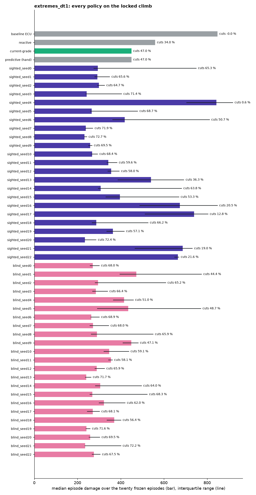
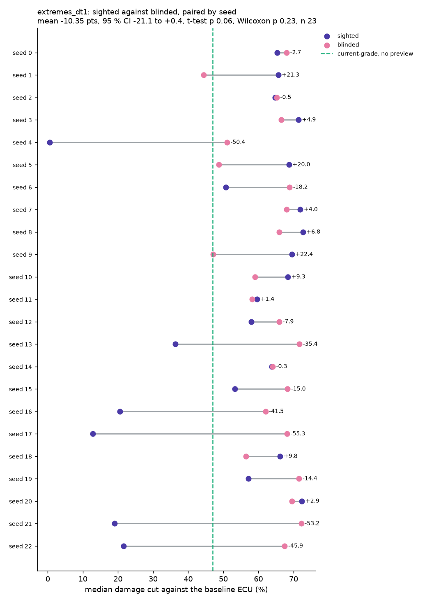
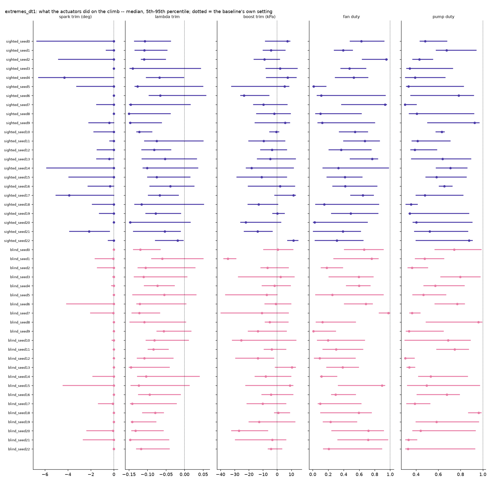
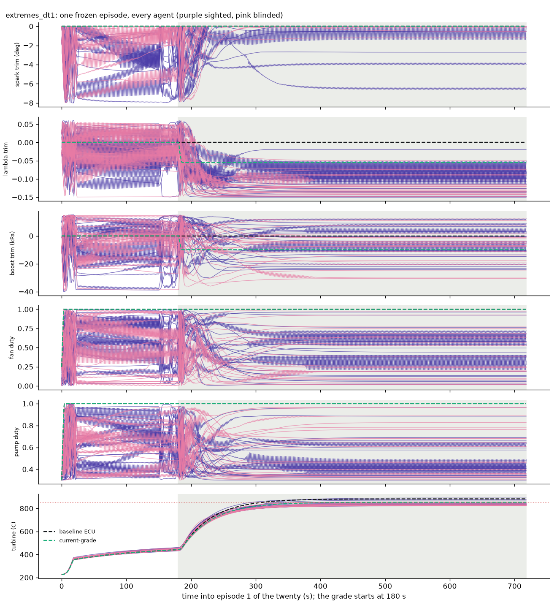
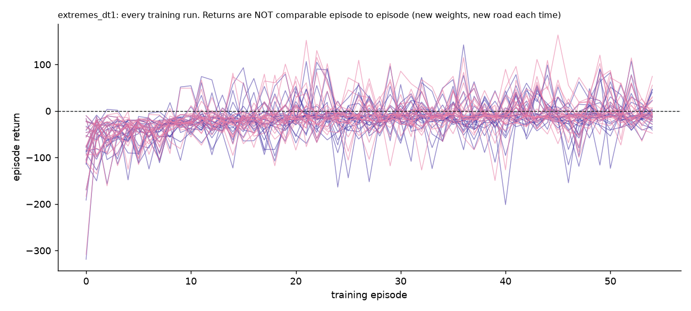

# Agents: `extremes_dt1`

Generated by `python record_agents.py` -- do not edit by hand; re-run it.

## How they were trained

- **roads**: a new road every episode, ambient 25-45 C, speed target 60-150 km/h changing mid-run, hills to 18 %, housing capacity x0.75-1.33 (ExtremesTrainingEnv, decision 12)
- **dt**: 1.0
- **steps**: 50000
- **total_timesteps**: 50000
- **steps_per_episode**: 900
- **device**: cpu
- **status**: finished
- **config_source**: written by train.py during training
- **SAC**: {"learning_rate": 0.0003, "buffer_size": 50000, "batch_size": 256, "learning_starts": 100, "gamma": 0.99, "tau": 0.005, "train_freq": "TrainFreq(frequency=1, unit=<TrainFrequencyUnit.STEP: 'step'>)", "gradient_steps": 1, "ent_coef": "auto", "target_entropy": -5.0, "policy": "MlpPolicy", "net_arch": "[256, 256]"}
- **plant data fingerprint**: `{"data_sha1": "c4fdd4babfb3752a", "raw_logs": ["3aca2ec1-20260907_072817.csv", "3f64372e-20260907_070041.csv", "670063b2-20260907_142018.csv", "683640a0-2026090`

## Scored on the twenty frozen episodes (`evaluate.EPISODES`)

The locked 12 % / 130 km/h climb, 720 s at dt 1.0, 42 C. Scores are `evaluate.run_episode`'s; 1000 episodes were compared with `results/phase_d_130kmh_raw.json` and are identical.

| policy | preview | median damage | IQR | worst | cut % | thermal-only cut % | fuel vs baseline % | peak turbine C | torque violation (median) | episodes trained | wall min |
|---|---|---|---|---|---|---|---|---|---|---|---|
| baseline ECU | no | 848.1 | 848-848 | 848.1 | 0.0 | 0.0 | +0.00 | 883 | 0.0 | - | - |
| reactive | no | 559.7 | 560-560 | 559.7 | 34.0 | 34.1 | +3.06 | 860 | 0.0 | - | - |
| current-grade | no | 449.6 | 450-450 | 449.6 | 47.0 | 47.2 | +5.85 | 853 | 0.1 | - | - |
| predictive (hand) | yes | 449.7 | 450-450 | 449.7 | 47.0 | 47.2 | +5.96 | 853 | 0.1 | - | - |
| sighted_seed0 | yes | 294.2 | 276-750 | 1000.4 | 65.3 | 65.3 | +15.34 | 891 | 0.0 | 55 | 232.6 |
| sighted_seed1 | yes | 291.5 | 279-349 | 423.0 | 65.6 | 65.5 | +14.16 | 853 | 0.0 | 55 | 245.4 |
| sighted_seed2 | yes | 299.5 | 293-325 | 361.9 | 64.7 | 64.6 | +15.01 | 840 | 0.0 | 55 | 238.0 |
| sighted_seed3 | yes | 242.6 | 239-404 | 888.5 | 71.4 | 71.3 | +20.75 | 884 | 0.1 | 55 | 238.0 |
| sighted_seed4 | yes | 843.0 | 705-919 | 941.3 | 0.6 | 0.3 | +15.51 | 891 | 0.0 | 55 | 240.0 |
| sighted_seed5 | yes | 265.4 | 260-479 | 900.1 | 68.7 | 68.6 | +16.77 | 885 | 0.0 | 55 | 243.6 |
| sighted_seed6 | yes | 418.1 | 363-811 | 909.9 | 50.7 | 50.6 | +7.60 | 886 | 0.0 | 55 | 239.2 |
| sighted_seed7 | yes | 238.1 | 236-271 | 898.0 | 71.9 | 71.8 | +21.46 | 885 | 0.1 | 55 | 239.7 |
| sighted_seed8 | yes | 231.9 | 231-243 | 480.5 | 72.7 | 72.6 | +22.06 | 854 | 0.0 | 55 | 238.8 |
| sighted_seed9 | yes | 258.7 | 252-268 | 301.2 | 69.5 | 69.5 | +21.61 | 831 | 0.1 | 55 | 239.5 |
| sighted_seed10 | yes | 268.1 | 264-293 | 350.2 | 68.4 | 68.4 | +16.92 | 838 | 0.4 | 55 | 242.5 |
| sighted_seed11 | yes | 342.9 | 336-383 | 569.0 | 59.6 | 59.5 | +10.90 | 862 | 0.0 | 55 | 237.6 |
| sighted_seed12 | yes | 356.2 | 341-394 | 473.3 | 58.0 | 57.9 | +10.21 | 855 | 0.1 | 55 | 223.7 |
| sighted_seed13 | yes | 540.4 | 387-692 | 861.6 | 36.3 | 36.1 | +6.37 | 883 | 0.0 | 55 | 223.8 |
| sighted_seed14 | yes | 307.2 | 296-682 | 2325.3 | 63.8 | 63.7 | +13.45 | 927 | 0.0 | 55 | 225.4 |
| sighted_seed15 | yes | 395.9 | 332-669 | 1244.4 | 53.3 | 53.3 | +8.78 | 901 | 0.0 | 55 | 222.4 |
| sighted_seed16 | yes | 674.2 | 489-848 | 860.4 | 20.5 | 20.3 | +5.36 | 883 | 0.9 | 55 | 225.0 |
| sighted_seed17 | yes | 739.4 | 513-804 | 894.5 | 12.8 | 12.6 | +13.09 | 882 | 0.8 | 55 | 224.6 |
| sighted_seed18 | yes | 286.9 | 268-527 | 888.6 | 66.2 | 66.1 | +15.03 | 884 | 0.0 | 55 | 220.1 |
| sighted_seed19 | yes | 363.7 | 336-417 | 498.3 | 57.1 | 57.0 | +9.02 | 857 | 0.2 | 55 | 223.0 |
| sighted_seed20 | yes | 234.3 | 233-286 | 844.9 | 72.4 | 72.3 | +20.98 | 883 | 0.0 | 55 | 221.5 |
| sighted_seed21 | yes | 686.9 | 466-732 | 963.1 | 19.0 | 18.8 | +8.46 | 889 | 0.0 | 55 | 218.0 |
| sighted_seed22 | yes | 665.1 | 649-670 | 678.8 | 21.6 | 21.4 | +3.66 | 874 | 0.0 | 55 | 219.9 |
| blind_seed0 | no | 271.2 | 259-301 | 358.3 | 68.0 | 68.1 | +15.86 | 841 | 0.0 | 55 | 235.5 |
| blind_seed1 | no | 471.8 | 396-774 | 875.8 | 44.4 | 44.3 | +8.14 | 884 | 0.3 | 55 | 240.2 |
| blind_seed2 | no | 295.1 | 282-608 | 1071.8 | 65.2 | 65.1 | +13.52 | 897 | 0.1 | 55 | 241.7 |
| blind_seed3 | no | 284.5 | 270-340 | 955.9 | 66.4 | 66.4 | +14.60 | 893 | 0.1 | 55 | 237.6 |
| blind_seed4 | no | 415.2 | 366-459 | 510.2 | 51.0 | 51.2 | +7.61 | 860 | 0.0 | 55 | 242.8 |
| blind_seed5 | no | 434.9 | 292-770 | 851.8 | 48.7 | 48.9 | +8.26 | 883 | 0.1 | 55 | 237.4 |
| blind_seed6 | no | 264.0 | 262-301 | 1808.3 | 68.9 | 68.8 | +16.13 | 920 | 0.0 | 55 | 234.4 |
| blind_seed7 | no | 271.7 | 258-345 | 387.6 | 68.0 | 67.9 | +17.78 | 846 | 0.0 | 55 | 241.7 |
| blind_seed8 | no | 289.5 | 264-550 | 752.7 | 65.9 | 65.8 | +14.42 | 878 | 0.0 | 55 | 238.4 |
| blind_seed9 | no | 448.5 | 410-481 | 527.9 | 47.1 | 47.1 | +5.85 | 858 | 0.0 | 55 | 242.7 |
| blind_seed10 | no | 347.1 | 322-437 | 775.8 | 59.1 | 59.0 | +9.98 | 877 | 0.2 | 55 | 234.5 |
| blind_seed11 | no | 354.9 | 343-362 | 421.2 | 58.1 | 58.1 | +9.52 | 853 | 0.1 | 55 | 220.7 |
| blind_seed12 | no | 289.2 | 280-325 | 423.6 | 65.9 | 65.8 | +13.85 | 848 | 0.1 | 55 | 225.5 |
| blind_seed13 | no | 240.4 | 237-263 | 458.6 | 71.7 | 71.7 | +21.01 | 853 | 0.0 | 55 | 222.6 |
| blind_seed14 | no | 305.0 | 283-496 | 905.1 | 64.0 | 64.0 | +13.50 | 884 | 0.1 | 55 | 226.0 |
| blind_seed15 | no | 269.1 | 258-523 | 784.7 | 68.3 | 68.2 | +17.10 | 878 | 0.1 | 55 | 222.3 |
| blind_seed16 | no | 322.2 | 300-420 | 732.0 | 62.0 | 62.0 | +11.91 | 875 | 0.1 | 55 | 223.6 |
| blind_seed17 | no | 270.4 | 245-302 | 426.1 | 68.1 | 68.1 | +20.58 | 850 | 0.0 | 55 | 223.9 |
| blind_seed18 | no | 369.8 | 337-401 | 422.3 | 56.4 | 56.3 | +10.25 | 853 | 0.0 | 55 | 222.5 |
| blind_seed19 | no | 241.2 | 239-259 | 273.5 | 71.6 | 71.5 | +19.12 | 829 | 0.1 | 55 | 221.8 |
| blind_seed20 | no | 258.5 | 254-303 | 510.8 | 69.5 | 69.4 | +18.83 | 857 | 0.1 | 55 | 221.1 |
| blind_seed21 | no | 235.8 | 234-401 | 540.0 | 72.2 | 72.3 | +21.97 | 865 | 0.1 | 55 | 220.8 |
| blind_seed22 | no | 275.7 | 268-305 | 439.3 | 67.5 | 67.5 | +15.14 | 851 | 0.0 | 55 | 218.3 |

## What stands out

- SPARK. The trim is capped at 0 for this set (engine_env.SPARK_TRIM_MAX): no agent can advance past the baseline, whose own spark on the climb is 1.2 deg. The median applied trim on the climb runs -4.3 to +0.0 deg across the agents, and the modelled knock integral's 95th percentile 0.61-0.64, against the baseline's 0.61 and the 0.85 knee where the damage model starts charging.
- SIGHTED_SEED0 does MORE damage than the baseline ECU on 4 of 20 episodes (numbers 12, 14, 15, 16; worst 1000 against 848, peak turbine 891 C). Their weight on component life is 0.034, 0.029, 0.049, 0.062 -- exactly the lowest in the frozen set. It is not trading life for fuel: on those episodes it burns +19.2, +18.1, +20.1, +18.0 % fuel against the baseline, and its return is -51, -35, -48, -36; by evaluate.py's own standard a protection policy that is sometimes terrible is not one.
- SIGHTED_SEED3 does MORE damage than the baseline ECU on 3 of 20 episodes (numbers 12, 14, 15; worst 889 against 848, peak turbine 884 C). Their weight on component life is 0.034, 0.029, 0.049 -- exactly the lowest in the frozen set. It is not trading life for fuel: on those episodes it burns +2.3, +1.4, +1.8 % fuel against the baseline, and its return is -9, -6, -7; by evaluate.py's own standard a protection policy that is sometimes terrible is not one.
- SIGHTED_SEED4 does MORE damage than the baseline ECU on 9 of 20 episodes (numbers 0, 2, 4, 5, 6, 8, 10, 18, 19; worst 941 against 848, peak turbine 891 C). Their weight on component life is 0.297, 0.249, 0.380, 0.302, 0.252, 0.253, 0.325, 0.313, 0.310. It is not trading life for fuel: on those episodes it burns +18.9, +17.7, +19.1, +15.7, +17.7, +17.9, +16.6, +19.0, +17.4 % fuel against the baseline, and its return is -11, -12, -10, -12, -12, -11, -15, -11, -15; by evaluate.py's own standard a protection policy that is sometimes terrible is not one.
- SIGHTED_SEED5 does MORE damage than the baseline ECU on 5 of 20 episodes (numbers 7, 12, 14, 15, 16; worst 900 against 848, peak turbine 885 C). Their weight on component life is 0.089, 0.034, 0.029, 0.049, 0.062 -- exactly the lowest in the frozen set. It is not trading life for fuel: on those episodes it burns +2.3, +2.5, +2.5, +2.6, +2.2 % fuel against the baseline, and its return is -9, -8, -7, -9, -8; by evaluate.py's own standard a protection policy that is sometimes terrible is not one.
- SIGHTED_SEED6 does MORE damage than the baseline ECU on 4 of 20 episodes (numbers 7, 12, 14, 15; worst 910 against 848, peak turbine 886 C). Their weight on component life is 0.089, 0.034, 0.029, 0.049. It is not trading life for fuel: on those episodes it burns +2.9, +3.6, +2.9, +3.4 % fuel against the baseline, and its return is -6, -11, -6, -10; by evaluate.py's own standard a protection policy that is sometimes terrible is not one.
- SIGHTED_SEED7 does MORE damage than the baseline ECU on 1 of 20 episodes (numbers 12; worst 898 against 848, peak turbine 885 C). Their weight on component life is 0.034. It is not trading life for fuel: on those episodes it burns +2.2 % fuel against the baseline, and its return is -17; by evaluate.py's own standard a protection policy that is sometimes terrible is not one.
- SIGHTED_SEED13 does MORE damage than the baseline ECU on 2 of 20 episodes (numbers 7, 12; worst 862 against 848, peak turbine 883 C). Their weight on component life is 0.089, 0.034. It is not trading life for fuel: on those episodes it burns +0.4, +1.6 % fuel against the baseline, and its return is -2, -6; by evaluate.py's own standard a protection policy that is sometimes terrible is not one.
- SIGHTED_SEED14 does MORE damage than the baseline ECU on 5 of 20 episodes (numbers 7, 12, 14, 15, 16; worst 2325 against 848, peak turbine 927 C). Their weight on component life is 0.089, 0.034, 0.029, 0.049, 0.062 -- exactly the lowest in the frozen set. It is not trading life for fuel: on those episodes it burns +5.5, +10.8, +6.9, +8.8, +5.5 % fuel against the baseline, and its return is -50, -62, -31, -59, -38; by evaluate.py's own standard a protection policy that is sometimes terrible is not one.
- SIGHTED_SEED15 does MORE damage than the baseline ECU on 5 of 20 episodes (numbers 7, 12, 14, 15, 16; worst 1244 against 848, peak turbine 901 C). Their weight on component life is 0.089, 0.034, 0.029, 0.049, 0.062 -- exactly the lowest in the frozen set. It is not trading life for fuel: on those episodes it burns +4.8, +3.8, +6.1, +4.5, +6.0 % fuel against the baseline, and its return is -28, -25, -23, -25, -27; by evaluate.py's own standard a protection policy that is sometimes terrible is not one.
- SIGHTED_SEED16 does MORE damage than the baseline ECU on 5 of 20 episodes (numbers 7, 9, 12, 15, 16; worst 860 against 848, peak turbine 883 C). Their weight on component life is 0.089, 0.216, 0.034, 0.049, 0.062. It is not trading life for fuel: on those episodes it burns +1.1, +3.1, +1.6, +1.4, +1.0 % fuel against the baseline, and its return is -17, -22, -16, -16, -17; by evaluate.py's own standard a protection policy that is sometimes terrible is not one.
- SIGHTED_SEED17 does MORE damage than the baseline ECU on 3 of 20 episodes (numbers 2, 6, 8; worst 894 against 848, peak turbine 882 C). Their weight on component life is 0.249, 0.252, 0.253. It is not trading life for fuel: on those episodes it burns +13.1, +13.1, +12.9 % fuel against the baseline, and its return is -45, -44, -43; by evaluate.py's own standard a protection policy that is sometimes terrible is not one.
- SIGHTED_SEED18 does MORE damage than the baseline ECU on 5 of 20 episodes (numbers 7, 12, 14, 15, 16; worst 889 against 848, peak turbine 884 C). Their weight on component life is 0.089, 0.034, 0.029, 0.049, 0.062 -- exactly the lowest in the frozen set. It is not trading life for fuel: on those episodes it burns +1.2, +2.1, +1.4, +1.9, +1.1 % fuel against the baseline, and its return is -7, -9, -6, -8, -6; by evaluate.py's own standard a protection policy that is sometimes terrible is not one.
- SIGHTED_SEED21 does MORE damage than the baseline ECU on 1 of 20 episodes (numbers 9; worst 963 against 848, peak turbine 889 C). Their weight on component life is 0.216. It is not trading life for fuel: on those episodes it burns +4.8 % fuel against the baseline, and its return is -27; by evaluate.py's own standard a protection policy that is sometimes terrible is not one.
- BLIND_SEED1 does MORE damage than the baseline ECU on 3 of 20 episodes (numbers 12, 14, 16; worst 876 against 848, peak turbine 884 C). Their weight on component life is 0.034, 0.029, 0.062. It is not trading life for fuel: on those episodes it burns +2.0, +1.9, +1.2 % fuel against the baseline, and its return is -10, -9, -6; by evaluate.py's own standard a protection policy that is sometimes terrible is not one.
- BLIND_SEED2 does MORE damage than the baseline ECU on 5 of 20 episodes (numbers 7, 12, 14, 15, 16; worst 1072 against 848, peak turbine 897 C). Their weight on component life is 0.089, 0.034, 0.029, 0.049, 0.062 -- exactly the lowest in the frozen set. It is not trading life for fuel: on those episodes it burns +2.1, +2.6, +2.7, +2.4, +2.3 % fuel against the baseline, and its return is -15, -16, -9, -14, -11; by evaluate.py's own standard a protection policy that is sometimes terrible is not one.
- BLIND_SEED3 does MORE damage than the baseline ECU on 1 of 20 episodes (numbers 12; worst 956 against 848, peak turbine 893 C). Their weight on component life is 0.034. It is not trading life for fuel: on those episodes it burns +2.4 % fuel against the baseline, and its return is -11; by evaluate.py's own standard a protection policy that is sometimes terrible is not one.
- BLIND_SEED5 does MORE damage than the baseline ECU on 2 of 20 episodes (numbers 14, 16; worst 852 against 848, peak turbine 883 C). Their weight on component life is 0.029, 0.062. It is not trading life for fuel: on those episodes it burns +1.5, +1.4 % fuel against the baseline, and its return is -8, -8; by evaluate.py's own standard a protection policy that is sometimes terrible is not one.
- BLIND_SEED6 does MORE damage than the baseline ECU on 2 of 20 episodes (numbers 12, 15; worst 1808 against 848, peak turbine 920 C). Their weight on component life is 0.034, 0.049. It is not trading life for fuel: on those episodes it burns +6.6, +5.4 % fuel against the baseline, and its return is -34, -27; by evaluate.py's own standard a protection policy that is sometimes terrible is not one.
- BLIND_SEED14 does MORE damage than the baseline ECU on 3 of 20 episodes (numbers 12, 14, 15; worst 905 against 848, peak turbine 884 C). Their weight on component life is 0.034, 0.029, 0.049 -- exactly the lowest in the frozen set. It is not trading life for fuel: on those episodes it burns +2.7, +1.5, +2.4 % fuel against the baseline, and its return is -10, -5, -10; by evaluate.py's own standard a protection policy that is sometimes terrible is not one.
- 39 of 46 agents beat the best hand-written policy on median damage (47.0 % cut). 0 burn less fuel than the baseline.

## The ablation, paired by seed

Sighted minus blinded damage cut, 23 pairs: mean **-10.35** points (median -0.51, sd 24.78), 95 % CI -21.06 to +0.37; paired t-test p = 0.058, exact Wilcoxon p = 0.234 (the smallest this n can give is 0.0000). Thermal-only damage (no knock term): mean -10.43 points, t-test p = 0.057.

| seed | sighted cut % | blinded cut % | difference | sighted minus current-grade |
|---|---|---|---|---|
| 0 | 65.31 | 68.02 | -2.70 | +18.33 |
| 1 | 65.63 | 44.37 | +21.26 | +18.65 |
| 2 | 64.69 | 65.20 | -0.51 | +17.71 |
| 3 | 71.39 | 66.45 | +4.94 | +24.41 |
| 4 | 0.60 | 51.04 | -50.44 | -46.38 |
| 5 | 68.71 | 48.72 | +19.99 | +21.73 |
| 6 | 50.70 | 68.87 | -18.17 | +3.72 |
| 7 | 71.93 | 67.97 | +3.96 | +24.95 |
| 8 | 72.66 | 65.86 | +6.80 | +25.67 |
| 9 | 69.50 | 47.12 | +22.38 | +22.52 |
| 10 | 68.38 | 59.07 | +9.31 | +21.40 |
| 11 | 59.57 | 58.15 | +1.42 | +12.59 |
| 12 | 57.99 | 65.89 | -7.90 | +11.01 |
| 13 | 36.28 | 71.65 | -35.37 | -10.70 |
| 14 | 63.78 | 64.04 | -0.26 | +16.80 |
| 15 | 53.32 | 68.27 | -14.95 | +6.34 |
| 16 | 20.50 | 62.01 | -41.51 | -26.48 |
| 17 | 12.82 | 68.12 | -55.30 | -34.16 |
| 18 | 66.17 | 56.40 | +9.77 | +19.19 |
| 19 | 57.11 | 71.56 | -14.45 | +10.13 |
| 20 | 72.37 | 69.52 | +2.85 | +25.39 |
| 21 | 19.01 | 72.20 | -53.19 | -27.97 |
| 22 | 21.58 | 67.49 | -45.91 | -25.40 |

## What the actuators did

Applied values after the slew limit, over all twenty episodes; median and 5th-95th percentile, flat road | climb. `neutral` is the baseline's own setting (trims 0; fan and pump at what the baseline runs). `slew %` is the share of steps where the policy asked for more movement than the slew limit allowed.

| policy | spark trim (deg) | lambda trim | boost trim (kPa) | fan duty | pump duty |
|---|---|---|---|---|---|
| baseline ECU | 0.00 [0.00, 0.00] &#124; 0.00 [0.00, 0.00]; slew 0 % | 0.00 [0.00, 0.00] &#124; 0.00 [0.00, 0.00]; slew 0 % | 0.00 [0.00, 0.00] &#124; 0.00 [0.00, 0.00]; slew 0 % | 1.00 [1.00, 1.00] &#124; 1.00 [1.00, 1.00]; slew 0 % | 1.00 [1.00, 1.00] &#124; 1.00 [1.00, 1.00]; slew 1 % |
| reactive | 0.00 [0.00, 0.00] &#124; 0.00 [0.00, 0.00]; slew 0 % | 0.00 [0.00, 0.00] &#124; -0.04 [-0.04, 0.00]; slew 0 % | 0.00 [0.00, 0.00] &#124; -7.37 [-7.40, 0.00]; slew 0 % | 1.00 [1.00, 1.00] &#124; 1.00 [1.00, 1.00]; slew 0 % | 1.00 [1.00, 1.00] &#124; 1.00 [1.00, 1.00]; slew 1 % |
| current-grade | 0.00 [0.00, 0.00] &#124; 0.00 [0.00, 0.00]; slew 0 % | 0.00 [0.00, 0.00] &#124; -0.06 [-0.06, -0.06]; slew 0 % | 0.00 [0.00, 0.00] &#124; -9.90 [-9.90, -9.90]; slew 0 % | 1.00 [1.00, 1.00] &#124; 1.00 [1.00, 1.00]; slew 0 % | 1.00 [1.00, 1.00] &#124; 1.00 [1.00, 1.00]; slew 1 % |
| predictive (hand) | 0.00 [0.00, 0.00] &#124; 0.00 [0.00, 0.00]; slew 0 % | 0.00 [-0.06, 0.00] &#124; -0.06 [-0.06, -0.06]; slew 0 % | 0.00 [-9.90, 0.00] &#124; -9.90 [-9.90, -9.90]; slew 0 % | 1.00 [1.00, 1.00] &#124; 1.00 [1.00, 1.00]; slew 0 % | 1.00 [1.00, 1.00] &#124; 1.00 [1.00, 1.00]; slew 1 % |
| sighted_seed0 | -0.26 [-4.08, 0.00] &#124; 0.00 [-6.70, 0.00]; slew 8 % | -0.02 [-0.04, 0.03] &#124; -0.11 [-0.13, -0.04]; slew 13 % | -7.39 [-23.04, 8.44] &#124; 7.29 [-8.23, 8.98]; slew 1 % | 0.34 [0.04, 0.86] &#124; 0.63 [0.49, 0.92]; slew 1 % | 0.38 [0.36, 0.81] &#124; 0.48 [0.44, 0.68]; slew 1 % |
| sighted_seed1 | 0.00 [-4.50, 0.00] &#124; 0.00 [-0.66, 0.00]; slew 2 % | 0.02 [-0.05, 0.06] &#124; -0.11 [-0.13, -0.05]; slew 15 % | -0.75 [-15.34, 12.99] &#124; -4.40 [-9.84, 5.56]; slew 3 % | 0.08 [0.00, 0.79] &#124; 0.39 [0.28, 0.51]; slew 1 % | 0.61 [0.38, 0.99] &#124; 0.68 [0.58, 0.94]; slew 1 % |
| sighted_seed2 | 0.00 [-4.74, 0.00] &#124; 0.00 [-4.81, 0.00]; slew 5 % | 0.01 [-0.06, 0.04] &#124; -0.11 [-0.12, -0.05]; slew 22 % | -0.07 [-25.00, 9.54] &#124; -8.93 [-16.33, 1.74]; slew 1 % | 0.55 [0.12, 0.76] &#124; 0.95 [0.64, 0.96]; slew 1 % | 0.51 [0.36, 0.94] &#124; 0.43 [0.37, 0.55]; slew 0 % |
| sighted_seed3 | -7.27 [-7.96, 0.00] &#124; 0.00 [0.00, 0.00]; slew 2 % | -0.03 [-0.13, 0.04] &#124; -0.14 [-0.15, 0.04]; slew 12 % | -12.43 [-38.10, 14.68] &#124; 2.08 [-7.98, 14.25]; slew 1 % | 0.63 [0.04, 0.93] &#124; 0.47 [0.36, 0.69]; slew 1 % | 0.75 [0.35, 0.90] &#124; 0.34 [0.32, 0.73]; slew 0 % |
| sighted_seed4 | -0.73 [-6.97, 0.00] &#124; -4.32 [-6.55, 0.00]; slew 12 % | 0.02 [-0.03, 0.05] &#124; -0.07 [-0.10, -0.00]; slew 48 % | -15.01 [-26.38, 3.45] &#124; 7.40 [-7.52, 13.40]; slew 2 % | 0.76 [0.13, 0.96] &#124; 0.53 [0.29, 0.71]; slew 7 % | 0.39 [0.32, 0.95] &#124; 0.39 [0.30, 0.66]; slew 1 % |
| sighted_seed5 | 0.00 [-2.13, 0.00] &#124; 0.00 [-3.24, 0.00]; slew 1 % | 0.04 [-0.08, 0.05] &#124; -0.13 [-0.13, 0.05]; slew 6 % | 0.05 [-7.37, 10.76] &#124; 5.33 [-32.23, 8.37]; slew 1 % | 0.76 [0.51, 0.96] &#124; 0.01 [0.00, 0.17]; slew 1 % | 0.51 [0.37, 0.89] &#124; 0.33 [0.31, 0.83]; slew 1 % |
| sighted_seed6 | 0.00 [-5.53, 0.00] &#124; 0.00 [0.00, 0.00]; slew 2 % | 0.04 [-0.04, 0.06] &#124; -0.07 [-0.10, 0.06]; slew 4 % | 8.25 [1.83, 14.46] &#124; -23.47 [-25.73, -5.81]; slew 0 % | 0.94 [0.25, 0.97] &#124; 0.11 [0.06, 0.94]; slew 1 % | 0.95 [0.59, 0.98] &#124; 0.78 [0.35, 0.92]; slew 1 % |
| sighted_seed7 | -0.18 [-5.36, 0.00] &#124; 0.00 [-1.50, 0.00]; slew 7 % | -0.01 [-0.08, 0.06] &#124; -0.15 [-0.15, 0.02]; slew 18 % | 6.60 [-39.36, 14.32] &#124; -9.67 [-16.57, 7.01]; slew 1 % | 0.98 [0.11, 1.00] &#124; 0.93 [0.37, 0.95]; slew 1 % | 0.36 [0.32, 1.00] &#124; 0.30 [0.30, 0.40]; slew 1 % |
| sighted_seed8 | 0.00 [-5.47, 0.00] &#124; 0.00 [0.00, 0.00]; slew 2 % | 0.00 [-0.05, 0.06] &#124; -0.15 [-0.15, -0.04]; slew 9 % | 9.63 [1.25, 14.58] &#124; -2.07 [-14.43, 9.33]; slew 1 % | 0.20 [0.03, 0.96] &#124; 0.10 [0.04, 0.63]; slew 1 % | 0.59 [0.34, 0.86] &#124; 0.41 [0.34, 0.92]; slew 2 % |
| sighted_seed9 | 0.00 [-2.94, 0.00] &#124; -0.39 [-2.19, 0.00]; slew 3 % | -0.02 [-0.07, 0.05] &#124; -0.15 [-0.15, -0.06]; slew 18 % | -14.60 [-21.74, 14.09] &#124; 5.65 [-15.66, 8.80]; slew 1 % | 0.79 [0.05, 0.91] &#124; 0.12 [0.07, 0.80]; slew 1 % | 0.74 [0.34, 0.94] &#124; 0.93 [0.50, 0.97]; slew 1 % |
| sighted_seed10 | -3.46 [-5.71, 0.00] &#124; 0.00 [-1.75, 0.00]; slew 5 % | 0.03 [-0.14, 0.06] &#124; -0.12 [-0.13, -0.09]; slew 5 % | 9.57 [-11.46, 14.49] &#124; -0.70 [-5.31, 1.26]; slew 1 % | 0.95 [0.28, 0.98] &#124; 0.55 [0.34, 0.71]; slew 1 % | 0.55 [0.43, 0.71] &#124; 0.63 [0.58, 0.66]; slew 2 % |
| sighted_seed11 | 0.00 [-1.68, 0.00] &#124; 0.00 [-0.36, 0.00]; slew 1 % | -0.03 [-0.12, 0.04] &#124; -0.07 [-0.11, 0.05]; slew 54 % | -38.07 [-38.80, 9.95] &#124; -9.55 [-20.06, 5.53]; slew 1 % | 0.21 [0.02, 0.95] &#124; 0.67 [0.40, 0.86]; slew 1 % | 0.88 [0.39, 0.99] &#124; 0.41 [0.37, 0.71]; slew 1 % |
| sighted_seed12 | 0.00 [-2.63, 0.00] &#124; 0.00 [-1.45, 0.00]; slew 2 % | -0.02 [-0.07, 0.03] &#124; -0.08 [-0.12, -0.04]; slew 41 % | 3.07 [-10.00, 9.05] &#124; -3.64 [-11.58, 6.67]; slew 3 % | 0.36 [0.12, 0.70] &#124; 0.37 [0.21, 0.75]; slew 4 % | 0.70 [0.48, 0.96] &#124; 0.39 [0.35, 0.59]; slew 1 % |
| sighted_seed13 | 0.00 [-3.93, 0.00] &#124; -0.40 [-1.50, 0.00]; slew 5 % | 0.02 [-0.03, 0.05] &#124; -0.05 [-0.11, 0.03]; slew 11 % | -0.52 [-11.85, 9.35] &#124; -4.89 [-13.96, 12.97]; slew 3 % | 0.45 [0.06, 0.64] &#124; 0.77 [0.48, 0.84]; slew 1 % | 0.38 [0.31, 0.86] &#124; 0.64 [0.36, 0.89]; slew 1 % |
| sighted_seed14 | -4.74 [-6.40, 0.00] &#124; 0.00 [-5.84, 0.00]; slew 4 % | -0.03 [-0.06, 0.03] &#124; -0.10 [-0.11, 0.04]; slew 23 % | -13.41 [-33.09, 1.49] &#124; -18.00 [-21.75, 11.53]; slew 1 % | 0.82 [0.32, 0.95] &#124; 0.33 [0.13, 0.98]; slew 1 % | 0.76 [0.46, 0.93] &#124; 0.71 [0.58, 0.86]; slew 1 % |
| sighted_seed15 | -2.98 [-6.49, 0.00] &#124; 0.00 [-3.92, 0.00]; slew 18 % | 0.05 [-0.08, 0.05] &#124; -0.08 [-0.10, 0.01]; slew 33 % | -9.73 [-24.03, 14.24] &#124; -11.00 [-28.40, 6.69]; slew 9 % | 0.74 [0.50, 0.84] &#124; 0.42 [0.18, 0.64]; slew 10 % | 0.47 [0.35, 0.93] &#124; 0.58 [0.49, 0.85]; slew 1 % |
| sighted_seed16 | -6.12 [-7.74, 0.00] &#124; -0.33 [-2.26, 0.00]; slew 26 % | -0.01 [-0.07, 0.06] &#124; -0.04 [-0.09, 0.03]; slew 48 % | 9.42 [-38.71, 14.72] &#124; 2.09 [-20.43, 12.32]; slew 2 % | 0.80 [0.08, 0.98] &#124; 0.42 [0.26, 0.83]; slew 0 % | 0.80 [0.32, 0.97] &#124; 0.66 [0.61, 0.73]; slew 1 % |
| sighted_seed17 | -1.34 [-4.71, 0.00] &#124; -3.89 [-5.03, 0.00]; slew 2 % | 0.04 [-0.02, 0.05] &#124; -0.07 [-0.10, -0.02]; slew 40 % | -2.82 [-29.01, 7.00] &#124; 11.47 [-1.66, 12.96]; slew 2 % | 0.53 [0.05, 0.79] &#124; 0.65 [0.49, 0.78]; slew 1 % | 0.74 [0.32, 0.98] &#124; 0.48 [0.40, 0.82]; slew 1 % |
| sighted_seed18 | 0.00 [-1.30, 0.00] &#124; 0.00 [-1.86, 0.00]; slew 2 % | 0.01 [-0.02, 0.04] &#124; -0.12 [-0.13, 0.05]; slew 33 % | -6.70 [-29.22, 13.56] &#124; -13.01 [-20.53, 0.42]; slew 12 % | 0.53 [0.18, 0.70] &#124; 0.15 [0.04, 0.85]; slew 1 % | 0.49 [0.31, 0.67] &#124; 0.35 [0.31, 0.41]; slew 0 % |
| sighted_seed19 | 0.00 [-2.22, 0.00] &#124; 0.00 [-1.25, 0.00]; slew 2 % | -0.00 [-0.05, 0.01] &#124; -0.08 [-0.10, -0.01]; slew 9 % | -28.40 [-35.92, 5.41] &#124; 0.18 [-3.10, 5.01]; slew 2 % | 0.55 [0.27, 0.96] &#124; 0.49 [0.24, 0.84]; slew 1 % | 0.81 [0.37, 0.96] &#124; 0.34 [0.34, 0.87]; slew 1 % |
| sighted_seed20 | -0.85 [-3.25, 0.00] &#124; 0.00 [0.00, 0.00]; slew 2 % | 0.04 [-0.04, 0.06] &#124; -0.15 [-0.15, 0.02]; slew 12 % | 10.36 [-1.64, 12.92] &#124; -22.11 [-25.75, 2.55]; slew 1 % | 0.35 [0.15, 0.89] &#124; 0.03 [0.01, 0.71]; slew 1 % | 0.63 [0.52, 0.91] &#124; 0.40 [0.37, 0.90]; slew 1 % |
| sighted_seed21 | -3.27 [-5.11, 0.00] &#124; -2.17 [-3.84, -0.37]; slew 28 % | 0.01 [-0.07, 0.04] &#124; -0.05 [-0.14, -0.01]; slew 35 % | -16.37 [-26.39, 14.03] &#124; -13.87 [-23.30, -3.41]; slew 4 % | 0.44 [0.10, 0.82] &#124; 0.39 [0.01, 0.62]; slew 1 % | 0.56 [0.35, 0.81] &#124; 0.52 [0.39, 0.87]; slew 1 % |
| sighted_seed22 | -2.23 [-6.07, 0.00] &#124; 0.00 [-0.48, 0.00]; slew 2 % | -0.06 [-0.10, 0.04] &#124; -0.02 [-0.08, -0.00]; slew 20 % | -19.98 [-29.37, 13.35] &#124; 11.56 [7.46, 14.67]; slew 1 % | 0.82 [0.02, 0.95] &#124; 0.31 [0.03, 0.65]; slew 1 % | 0.72 [0.38, 0.85] &#124; 0.88 [0.40, 0.91]; slew 0 % |
| blind_seed0 | 0.00 [-0.95, 0.00] &#124; 0.00 [0.00, 0.00]; slew 1 % | -0.01 [-0.07, 0.03] &#124; -0.12 [-0.14, -0.07]; slew 26 % | -19.59 [-22.21, 14.11] &#124; 0.54 [-9.57, 11.23]; slew 1 % | 0.78 [0.19, 0.86] &#124; 0.66 [0.41, 0.91]; slew 1 % | 0.70 [0.51, 0.98] &#124; 0.74 [0.57, 0.99]; slew 0 % |
| blind_seed1 | -0.22 [-2.17, 0.00] &#124; -0.05 [-1.62, 0.00]; slew 2 % | 0.02 [-0.05, 0.06] &#124; -0.06 [-0.09, 0.05]; slew 4 % | -30.65 [-38.40, 11.42] &#124; -34.87 [-37.75, -29.18]; slew 3 % | 0.61 [0.47, 0.82] &#124; 0.76 [0.27, 0.85]; slew 1 % | 0.83 [0.44, 0.97] &#124; 0.48 [0.39, 0.65]; slew 2 % |
| blind_seed2 | 0.00 [-2.18, 0.00] &#124; 0.00 [-1.44, 0.00]; slew 2 % | -0.00 [-0.11, 0.06] &#124; -0.10 [-0.13, 0.03]; slew 4 % | -31.42 [-39.12, 9.62] &#124; -6.79 [-11.47, 7.97]; slew 2 % | 0.69 [0.22, 0.98] &#124; 0.18 [0.11, 0.39]; slew 1 % | 0.42 [0.38, 0.65] &#124; 0.36 [0.33, 0.51]; slew 0 % |
| blind_seed3 | 0.00 [-2.59, 0.00] &#124; 0.00 [-0.11, 0.00]; slew 1 % | 0.04 [-0.03, 0.05] &#124; -0.11 [-0.14, 0.01]; slew 9 % | 2.43 [-11.17, 12.43] &#124; 2.49 [-27.34, 11.97]; slew 1 % | 0.28 [0.07, 0.88] &#124; 0.60 [0.21, 0.78]; slew 2 % | 0.89 [0.63, 0.95] &#124; 0.80 [0.62, 0.98]; slew 3 % |
| blind_seed4 | 0.00 [-1.93, 0.00] &#124; 0.00 [-0.21, 0.00]; slew 1 % | -0.01 [-0.04, 0.04] &#124; -0.07 [-0.11, -0.03]; slew 33 % | 13.97 [-8.73, 14.95] &#124; -1.94 [-10.63, 9.38]; slew 14 % | 0.76 [0.40, 0.91] &#124; 0.60 [0.43, 0.74]; slew 2 % | 0.63 [0.44, 0.87] &#124; 0.57 [0.47, 0.83]; slew 8 % |
| blind_seed5 | -1.14 [-5.82, 0.00] &#124; 0.00 [0.00, 0.00]; slew 8 % | -0.14 [-0.15, 0.04] &#124; -0.05 [-0.14, 0.03]; slew 22 % | 12.35 [0.64, 14.91] &#124; -7.36 [-36.42, -0.11]; slew 20 % | 0.14 [0.02, 0.65] &#124; 0.25 [0.04, 0.91]; slew 1 % | 0.79 [0.66, 0.98] &#124; 0.47 [0.37, 0.67]; slew 2 % |
| blind_seed6 | 0.00 [-4.80, 0.00] &#124; 0.00 [-4.11, 0.00]; slew 1 % | 0.04 [0.00, 0.06] &#124; -0.12 [-0.13, 0.00]; slew 9 % | 12.88 [2.49, 14.14] &#124; -0.94 [-8.70, 9.78]; slew 1 % | 0.53 [0.29, 0.80] &#124; 0.69 [0.41, 0.77]; slew 2 % | 0.62 [0.39, 0.92] &#124; 0.77 [0.57, 0.83]; slew 1 % |
| blind_seed7 | 0.00 [-2.01, 0.00] &#124; -0.06 [-2.02, 0.00]; slew 2 % | -0.03 [-0.10, 0.02] &#124; -0.12 [-0.14, -0.07]; slew 29 % | 2.37 [-36.39, 13.63] &#124; -10.74 [-39.70, 8.03]; slew 1 % | 0.90 [0.53, 1.00] &#124; 0.98 [0.86, 1.00]; slew 1 % | 0.35 [0.32, 0.53] &#124; 0.36 [0.34, 0.44]; slew 1 % |
| blind_seed8 | 0.00 [-3.81, 0.00] &#124; 0.00 [0.00, 0.00]; slew 5 % | 0.01 [0.00, 0.04] &#124; -0.11 [-0.15, 0.00]; slew 43 % | 8.31 [-4.86, 12.28] &#124; -5.28 [-8.37, 7.74]; slew 3 % | 0.70 [0.31, 0.89] &#124; 0.13 [0.05, 0.55]; slew 1 % | 0.36 [0.31, 0.70] &#124; 0.96 [0.49, 0.99]; slew 2 % |
| blind_seed9 | -0.95 [-4.50, 0.00] &#124; 0.00 [0.00, 0.00]; slew 1 % | 0.03 [-0.01, 0.05] &#124; -0.06 [-0.07, 0.02]; slew 7 % | 10.51 [-10.17, 14.20] &#124; -13.68 [-20.35, 6.57]; slew 1 % | 0.97 [0.79, 0.99] &#124; 0.01 [0.00, 0.29]; slew 1 % | 0.65 [0.54, 0.76] &#124; 0.34 [0.31, 0.65]; slew 1 % |
| blind_seed10 | 0.00 [-3.88, 0.00] &#124; 0.00 [-0.16, 0.00]; slew 1 % | -0.03 [-0.06, -0.01] &#124; -0.08 [-0.10, 0.01]; slew 28 % | -17.71 [-31.30, 5.18] &#124; -25.38 [-31.57, 13.34]; slew 3 % | 0.25 [0.05, 0.93] &#124; 0.20 [0.06, 0.67]; slew 0 % | 0.41 [0.32, 0.60] &#124; 0.69 [0.30, 0.89]; slew 2 % |
| blind_seed11 | 0.00 [-4.59, 0.00] &#124; 0.00 [0.00, 0.00]; slew 1 % | 0.05 [-0.01, 0.05] &#124; -0.08 [-0.10, -0.04]; slew 4 % | -9.54 [-35.31, 11.50] &#124; -3.82 [-9.23, 6.09]; slew 1 % | 0.67 [0.25, 0.84] &#124; 0.30 [0.13, 0.65]; slew 1 % | 0.67 [0.48, 0.78] &#124; 0.75 [0.59, 0.87]; slew 1 % |
| blind_seed12 | 0.00 [-1.08, 0.00] &#124; 0.00 [0.00, 0.00]; slew 1 % | 0.03 [-0.02, 0.05] &#124; -0.11 [-0.13, -0.03]; slew 23 % | -8.62 [-22.64, 4.67] &#124; -13.57 [-29.34, -2.32]; slew 2 % | 0.28 [0.05, 0.87] &#124; 0.09 [0.02, 0.55]; slew 3 % | 0.53 [0.30, 0.61] &#124; 0.30 [0.30, 0.38]; slew 0 % |
| blind_seed13 | -5.03 [-7.33, 0.00] &#124; 0.00 [0.00, 0.00]; slew 9 % | -0.03 [-0.09, 0.03] &#124; -0.14 [-0.15, -0.04]; slew 33 % | -17.63 [-32.12, 7.71] &#124; 10.38 [-1.29, 12.99]; slew 2 % | 0.02 [0.00, 0.91] &#124; 0.39 [0.18, 0.59]; slew 2 % | 0.88 [0.50, 0.98] &#124; 0.34 [0.32, 0.39]; slew 1 % |
| blind_seed14 | -4.29 [-6.24, 0.00] &#124; 0.00 [-1.82, 0.00]; slew 2 % | 0.03 [-0.07, 0.05] &#124; -0.10 [-0.13, 0.04]; slew 9 % | -8.19 [-35.21, 10.11] &#124; -8.10 [-15.64, 9.81]; slew 4 % | 0.34 [0.12, 0.62] &#124; 0.11 [0.10, 0.31]; slew 1 % | 0.79 [0.55, 0.89] &#124; 0.53 [0.42, 0.86]; slew 0 % |
| blind_seed15 | 0.00 [-4.26, 0.00] &#124; 0.00 [-4.42, 0.00]; slew 4 % | 0.01 [-0.02, 0.03] &#124; -0.12 [-0.14, 0.01]; slew 33 % | -2.36 [-17.19, 13.50] &#124; 8.99 [-22.11, 11.08]; slew 1 % | 0.97 [0.53, 0.99] &#124; 0.89 [0.33, 0.93]; slew 1 % | 0.39 [0.33, 0.71] &#124; 0.50 [0.32, 0.97]; slew 1 % |
| blind_seed16 | 0.00 [-7.50, 0.00] &#124; 0.00 [0.00, 0.00]; slew 2 % | 0.05 [-0.08, 0.06] &#124; -0.09 [-0.12, -0.01]; slew 10 % | 11.30 [1.60, 14.54] &#124; -4.28 [-10.69, 11.15]; slew 0 % | 0.16 [0.09, 0.80] &#124; 0.29 [0.24, 0.55]; slew 1 % | 0.82 [0.67, 0.90] &#124; 0.68 [0.41, 0.79]; slew 1 % |
| blind_seed17 | 0.00 [-1.07, 0.00] &#124; -0.08 [-1.34, 0.00]; slew 1 % | -0.02 [-0.04, 0.01] &#124; -0.14 [-0.15, -0.02]; slew 25 % | -25.44 [-32.06, 2.81] &#124; -10.26 [-21.25, 6.15]; slew 2 % | 0.17 [0.10, 0.49] &#124; 0.10 [0.07, 0.62]; slew 1 % | 0.78 [0.52, 0.83] &#124; 0.39 [0.32, 0.53]; slew 1 % |
| blind_seed18 | -0.20 [-3.71, 0.00] &#124; 0.00 [0.00, 0.00]; slew 1 % | -0.00 [-0.04, 0.04] &#124; -0.08 [-0.11, -0.06]; slew 17 % | 7.20 [1.81, 12.28] &#124; 0.83 [-1.82, 8.88]; slew 0 % | 0.62 [0.25, 0.79] &#124; 0.59 [0.10, 0.76]; slew 2 % | 0.75 [0.54, 0.86] &#124; 0.96 [0.87, 0.98]; slew 0 % |
| blind_seed19 | 0.00 [-1.37, 0.00] &#124; 0.00 [0.00, 0.00]; slew 1 % | 0.04 [-0.00, 0.05] &#124; -0.14 [-0.14, -0.08]; slew 12 % | 0.00 [-5.74, 9.04] &#124; -12.68 [-19.92, 12.53]; slew 1 % | 0.04 [0.02, 0.88] &#124; 0.23 [0.14, 0.57]; slew 2 % | 0.59 [0.44, 0.87] &#124; 0.58 [0.40, 0.96]; slew 1 % |
| blind_seed20 | -0.11 [-3.72, 0.00] &#124; -0.08 [-2.35, 0.00]; slew 8 % | 0.06 [-0.06, 0.06] &#124; -0.13 [-0.14, -0.06]; slew 16 % | 12.79 [10.06, 14.79] &#124; -26.90 [-32.10, -6.67]; slew 1 % | 0.04 [0.02, 0.42] &#124; 0.72 [0.25, 0.91]; slew 2 % | 0.58 [0.33, 0.65] &#124; 0.44 [0.37, 0.93]; slew 0 % |
| blind_seed21 | 0.00 [-1.68, 0.00] &#124; 0.00 [-2.66, 0.00]; slew 5 % | -0.03 [-0.08, 0.04] &#124; -0.15 [-0.15, -0.04]; slew 34 % | -9.21 [-18.80, 6.77] &#124; -3.49 [-29.45, 6.14]; slew 8 % | 0.51 [0.33, 0.96] &#124; 0.72 [0.32, 0.97]; slew 1 % | 0.58 [0.38, 0.83] &#124; 0.33 [0.31, 0.41]; slew 3 % |
| blind_seed22 | 0.00 [-5.58, 0.00] &#124; 0.00 [0.00, 0.00]; slew 1 % | 0.01 [-0.07, 0.04] &#124; -0.12 [-0.13, -0.04]; slew 10 % | 1.93 [-9.57, 11.79] &#124; -4.35 [-6.34, 3.30]; slew 0 % | 0.06 [0.03, 0.46] &#124; 0.21 [0.14, 0.89]; slew 1 % | 0.72 [0.38, 0.99] &#124; 0.33 [0.31, 0.93]; slew 1 % |

## Files

Per policy, in its folder: `eval_summary.json` (every episode scored), `eval_record.npz` (every step of the twenty episodes, arrays `[episode, step, ...]`: `action`, `applied`, `obs`, `reward`, `r_fuel`, `r_life`, `r_resp`, `rpm`, `map_kpa`, `grade`, `spark`, `lam`, `torque`, `torque_req`, `ki`, `egt_c`, `mdot_fuel`, `t_turb`, `t_oil`, `t_block`, `t_turb_base`, `damage_rate`, plus `episode_seed` and `weights`). Per agent also: `config.json`, `curve.csv`, `policy.npz` (the actor's weights) and, for agents trained since 29 September, `train_record.npz` (every training step: `step`, `episode`, `action`, `obs`, `reward`, the reward terms and the engine state).

**The two `*_record.npz` files are kept on disk and not in git** (the team's decision, 29 September: 85 MB of binaries). They stay on the machine that trained the agents, beside the models in `runs/` (also gitignored): only there can `python record_agents.py <set>` regenerate `eval_record.npz`, and `train_record.npz` cannot be regenerated at all. Everything else here is committed, and `eval_summary.json` carries the statistics read from the records.

## Figures

_117 min to generate._
