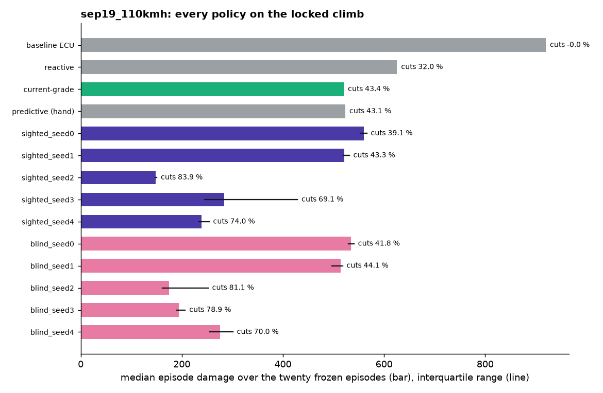
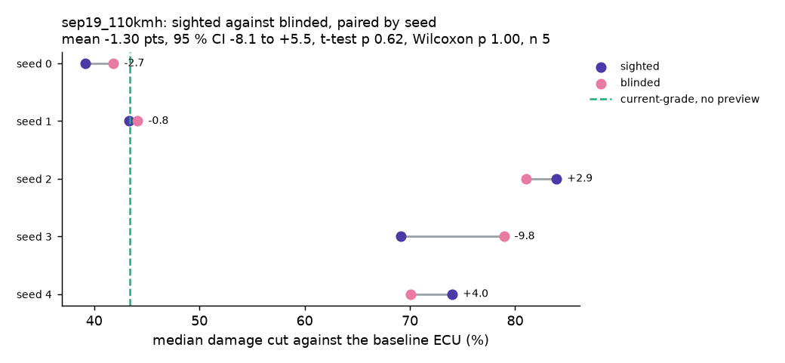
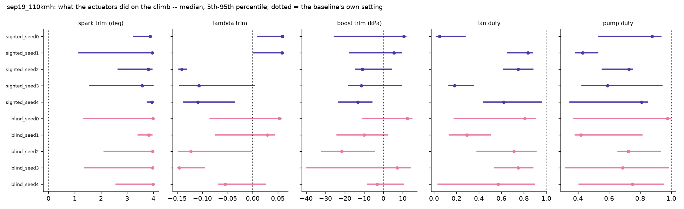
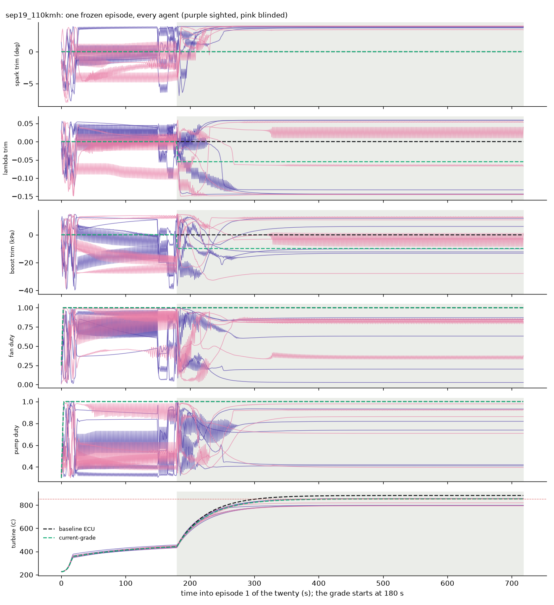
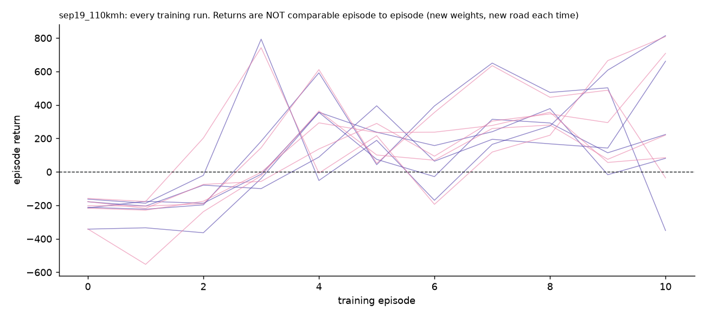

# Agents: `sep19_110kmh`

Generated by `python record_agents.py` -- do not edit by hand; re-run it.

## How they were trained

- **trained**: 19 September 2026, ten runs sharing the team laptop, 173 min
- **scenario**: the locked climb ONLY, at 110 km/h (the lock moved to 130 km/h the same day)
- **roads**: one road: make_grade_climb at 110 km/h
- **dt**: 0.2
- **total_timesteps**: 50000
- **steps_per_episode**: 4499
- **plant**: before 27 Sep (gearbox kickdown, spark refit) and before 28 Sep (derived constants)
- **status**: A RECORD, NOT A RESULT: trained at 110 km/h where nothing binds, at dt 0.2 while scored at 1.0, on one road, on an older plant. Kept so the retrain has a before.
- **config_source**: read back out of final.zip on 2026-09-29; train.py wrote no config before 29 September
- **SAC**: {"learning_rate": 0.0003, "buffer_size": 1000000, "batch_size": 256, "learning_starts": 100, "gamma": 0.99, "tau": 0.005, "train_freq": "TrainFreq(frequency=1, unit=<TrainFrequencyUnit.STEP: 'step'>)", "gradient_steps": 1, "ent_coef": "auto", "target_entropy": -5.0, "policy": "MlpPolicy", "net_arch": "[256, 256]"}

## Scored on the twenty frozen episodes (`evaluate.EPISODES`)

The locked 12 % / 130 km/h climb, 720 s at dt 1.0, 42 C. Scores are `evaluate.run_episode`'s; 0 episodes were compared with `results/phase_d_130kmh_raw.json` and are identical.

| policy | preview | median damage | IQR | worst | cut % | thermal-only cut % | fuel vs baseline % | peak turbine C | torque violation (median) | episodes trained | wall min |
|---|---|---|---|---|---|---|---|---|---|---|---|
| baseline ECU | no | 920.1 | 920-920 | 920.1 | 0.0 | 0.0 | +0.00 | 883 | 0.0 | - | - |
| reactive | no | 625.7 | 626-626 | 625.7 | 32.0 | 34.2 | +3.10 | 860 | 0.0 | - | - |
| current-grade | no | 520.5 | 521-521 | 520.5 | 43.4 | 47.2 | +5.87 | 853 | 0.0 | - | - |
| predictive (hand) | yes | 523.5 | 523-523 | 523.5 | 43.1 | 47.2 | +5.97 | 853 | 0.0 | - | - |
| sighted_seed0 | yes | 559.9 | 552-566 | 575.4 | 39.1 | 43.0 | -1.89 | 857 | 0.0 | 11 | - |
| sighted_seed1 | yes | 521.5 | 519-531 | 536.8 | 43.3 | 43.1 | -1.44 | 856 | 0.1 | 11 | - |
| sighted_seed2 | yes | 147.9 | 147-150 | 163.3 | 83.9 | 83.8 | +15.82 | 798 | 0.7 | 11 | - |
| sighted_seed3 | yes | 284.3 | 245-429 | 450.4 | 69.1 | 75.7 | +10.44 | 845 | 0.8 | 11 | - |
| sighted_seed4 | yes | 239.0 | 234-254 | 327.2 | 74.0 | 82.0 | +9.35 | 827 | 0.8 | 11 | - |
| blind_seed0 | no | 535.1 | 530-541 | 548.5 | 41.8 | 45.4 | -0.71 | 855 | 0.2 | 11 | - |
| blind_seed1 | no | 513.9 | 497-518 | 528.9 | 44.1 | 47.0 | -2.51 | 857 | 0.0 | 11 | - |
| blind_seed2 | no | 174.2 | 162-252 | 436.9 | 81.1 | 82.2 | +11.25 | 839 | 0.3 | 11 | - |
| blind_seed3 | no | 193.8 | 190-207 | 232.0 | 78.9 | 84.5 | +16.70 | 808 | 0.0 | 11 | - |
| blind_seed4 | no | 275.6 | 255-301 | 475.5 | 70.0 | 71.5 | +1.33 | 851 | 0.1 | 11 | - |

## What stands out

- SPARK. On the climb every agent advances spark 3.6-4.0 deg past the baseline (median; the trim's upper bound is +4), whose own spark there is 1.2 deg. That takes the modelled knock integral from the baseline's 0.61 to 0.73-0.79 (95th percentile), just under the 0.85 knee where the damage model starts charging for knock. Part of what the agents save is margin the production-representative baseline keeps and the UNTESTED knock model says is not needed (CLAUDE.md, the knock model). Sighted and blinded do it alike, so it does not touch the ablation; it does touch every agent-versus-hand-written gap. How much of the gain it is: KNOCK_MARGIN.md beside this file (knock_margin.py), where it exists.
- 7 of 10 agents beat the best hand-written policy on median damage (43.4 % cut). 4 burn less fuel than the baseline.

## The ablation, paired by seed

Sighted minus blinded damage cut, 5 pairs: mean **-1.30** points (median -0.82, sd 5.48), 95 % CI -8.11 to +5.50; paired t-test p = 0.623, exact Wilcoxon p = 1.000 (the smallest this n can give is 0.0625). Thermal-only damage (no knock term): mean -0.64 points, t-test p = 0.853.

| seed | sighted cut % | blinded cut % | difference | sighted minus current-grade |
|---|---|---|---|---|
| 0 | 39.14 | 41.84 | -2.70 | -4.28 |
| 1 | 43.32 | 44.14 | -0.82 | -0.11 |
| 2 | 83.93 | 81.07 | +2.86 | +40.50 |
| 3 | 69.10 | 78.94 | -9.83 | +25.68 |
| 4 | 74.02 | 70.05 | +3.98 | +30.60 |

## What the actuators did

Applied values after the slew limit, over all twenty episodes; median and 5th-95th percentile, flat road | climb. `neutral` is the baseline's own setting (trims 0; fan and pump at what the baseline runs). `slew %` is the share of steps where the policy asked for more movement than the slew limit allowed.

| policy | spark trim (deg) | lambda trim | boost trim (kPa) | fan duty | pump duty |
|---|---|---|---|---|---|
| baseline ECU | 0.00 [0.00, 0.00] &#124; 0.00 [0.00, 0.00]; slew 0 % | 0.00 [0.00, 0.00] &#124; 0.00 [0.00, 0.00]; slew 0 % | 0.00 [0.00, 0.00] &#124; 0.00 [0.00, 0.00]; slew 0 % | 1.00 [1.00, 1.00] &#124; 1.00 [1.00, 1.00]; slew 0 % | 1.00 [1.00, 1.00] &#124; 1.00 [1.00, 1.00]; slew 1 % |
| reactive | 0.00 [0.00, 0.00] &#124; 0.00 [0.00, 0.00]; slew 0 % | 0.00 [0.00, 0.00] &#124; -0.04 [-0.04, 0.00]; slew 0 % | 0.00 [0.00, 0.00] &#124; -7.37 [-7.40, 0.00]; slew 0 % | 1.00 [1.00, 1.00] &#124; 1.00 [1.00, 1.00]; slew 0 % | 1.00 [1.00, 1.00] &#124; 1.00 [1.00, 1.00]; slew 1 % |
| current-grade | 0.00 [0.00, 0.00] &#124; 0.00 [0.00, 0.00]; slew 0 % | 0.00 [0.00, 0.00] &#124; -0.06 [-0.06, -0.06]; slew 0 % | 0.00 [0.00, 0.00] &#124; -9.90 [-9.90, -9.90]; slew 0 % | 1.00 [1.00, 1.00] &#124; 1.00 [1.00, 1.00]; slew 0 % | 1.00 [1.00, 1.00] &#124; 1.00 [1.00, 1.00]; slew 1 % |
| predictive (hand) | 0.00 [0.00, 0.00] &#124; 0.00 [0.00, 0.00]; slew 0 % | 0.00 [-0.06, 0.00] &#124; -0.06 [-0.06, -0.06]; slew 0 % | 0.00 [-9.90, 0.00] &#124; -9.90 [-9.90, -9.90]; slew 0 % | 1.00 [1.00, 1.00] &#124; 1.00 [1.00, 1.00]; slew 0 % | 1.00 [1.00, 1.00] &#124; 1.00 [1.00, 1.00]; slew 1 % |
| sighted_seed0 | 2.66 [-3.54, 3.73] &#124; 3.87 [3.25, 3.91]; slew 6 % | 0.04 [-0.03, 0.05] &#124; 0.06 [0.01, 0.06]; slew 16 % | -3.16 [-25.98, 10.53] &#124; 10.52 [-25.47, 11.73]; slew 9 % | 0.58 [0.06, 0.83] &#124; 0.05 [0.02, 0.28]; slew 2 % | 0.75 [0.32, 0.92] &#124; 0.88 [0.53, 0.93]; slew 5 % |
| sighted_seed1 | 3.52 [-2.76, 3.96] &#124; 3.95 [1.16, 3.97]; slew 7 % | -0.02 [-0.08, 0.03] &#124; 0.06 [0.00, 0.06]; slew 25 % | 10.15 [-32.57, 14.60] &#124; 5.43 [-17.36, 9.27]; slew 3 % | 0.53 [0.07, 0.89] &#124; 0.84 [0.65, 0.88]; slew 14 % | 0.66 [0.40, 0.93] &#124; 0.43 [0.38, 0.53]; slew 5 % |
| sighted_seed2 | -0.87 [-7.30, 2.56] &#124; 3.81 [2.65, 3.94]; slew 6 % | 0.02 [-0.14, 0.05] &#124; -0.14 [-0.15, -0.13]; slew 9 % | 8.07 [-18.96, 12.06] &#124; -10.88 [-14.30, 4.18]; slew 3 % | 0.45 [0.01, 0.98] &#124; 0.75 [0.62, 0.88]; slew 3 % | 0.81 [0.33, 0.98] &#124; 0.73 [0.56, 0.75]; slew 3 % |
| sighted_seed3 | 2.78 [-5.03, 3.72] &#124; 3.56 [1.57, 3.98]; slew 12 % | 0.04 [-0.00, 0.06] &#124; -0.11 [-0.15, 0.00]; slew 30 % | -4.45 [-25.53, 9.80] &#124; -11.40 [-17.99, 9.26]; slew 15 % | 0.73 [0.29, 0.92] &#124; 0.18 [0.13, 0.35]; slew 7 % | 0.39 [0.33, 0.88] &#124; 0.59 [0.42, 0.94]; slew 3 % |
| sighted_seed4 | -0.73 [-5.68, 3.60] &#124; 3.95 [3.77, 3.98]; slew 20 % | 0.01 [-0.07, 0.04] &#124; -0.11 [-0.14, -0.04]; slew 40 % | -20.46 [-35.64, -7.59] &#124; -13.22 [-22.97, -5.88]; slew 17 % | 0.86 [0.43, 0.99] &#124; 0.62 [0.44, 0.95]; slew 6 % | 0.37 [0.31, 0.83] &#124; 0.81 [0.35, 0.85]; slew 4 % |
| blind_seed0 | -2.53 [-4.62, 0.42] &#124; 3.98 [1.36, 4.00]; slew 6 % | 0.01 [-0.04, 0.04] &#124; 0.05 [-0.08, 0.06]; slew 14 % | 10.25 [-15.71, 12.48] &#124; 12.45 [-10.67, 14.78]; slew 3 % | 0.89 [0.37, 0.98] &#124; 0.81 [0.18, 0.90]; slew 2 % | 0.87 [0.32, 0.99] &#124; 0.98 [0.37, 1.00]; slew 3 % |
| blind_seed1 | 1.74 [-2.24, 3.54] &#124; 3.82 [3.42, 3.95]; slew 4 % | 0.04 [-0.09, 0.05] &#124; 0.03 [-0.07, 0.04]; slew 27 % | -1.42 [-27.84, 13.85] &#124; -9.94 [-23.90, 2.07]; slew 23 % | 0.25 [0.07, 0.72] &#124; 0.29 [0.14, 0.50]; slew 2 % | 0.60 [0.47, 0.78] &#124; 0.42 [0.38, 0.81]; slew 1 % |
| blind_seed2 | -3.19 [-6.20, 2.39] &#124; 3.96 [2.12, 3.99]; slew 21 % | -0.01 [-0.10, 0.02] &#124; -0.12 [-0.15, -0.00]; slew 39 % | -12.07 [-25.55, 3.63] &#124; -21.50 [-31.90, -4.75]; slew 2 % | 0.98 [0.31, 1.00] &#124; 0.71 [0.38, 0.91]; slew 7 % | 0.43 [0.36, 0.55] &#124; 0.72 [0.66, 0.93]; slew 2 % |
| blind_seed3 | -0.34 [-4.01, 1.73] &#124; 3.97 [1.39, 3.98]; slew 32 % | -0.08 [-0.14, -0.02] &#124; -0.15 [-0.15, -0.10]; slew 30 % | -1.20 [-20.31, 10.44] &#124; 7.14 [-39.51, 13.82]; slew 2 % | 0.83 [0.41, 0.96] &#124; 0.75 [0.54, 0.88]; slew 4 % | 0.37 [0.32, 0.96] &#124; 0.69 [0.32, 0.98]; slew 2 % |
| blind_seed4 | 1.18 [-3.44, 3.21] &#124; 3.98 [2.58, 3.99]; slew 11 % | 0.02 [-0.07, 0.05] &#124; -0.05 [-0.07, 0.03]; slew 19 % | -29.23 [-34.51, -0.40] &#124; -3.22 [-8.10, 10.45]; slew 4 % | 0.66 [0.25, 0.95] &#124; 0.57 [0.04, 0.90]; slew 5 % | 0.77 [0.43, 0.91] &#124; 0.75 [0.41, 0.95]; slew 12 % |

## Files

Per policy, in its folder: `eval_summary.json` (every episode scored), `eval_record.npz` (every step of the twenty episodes, arrays `[episode, step, ...]`: `action`, `applied`, `obs`, `reward`, `r_fuel`, `r_life`, `r_resp`, `rpm`, `map_kpa`, `grade`, `spark`, `lam`, `torque`, `torque_req`, `ki`, `egt_c`, `mdot_fuel`, `t_turb`, `t_oil`, `t_block`, `t_turb_base`, `damage_rate`, plus `episode_seed` and `weights`). Per agent also: `config.json`, `curve.csv`, `policy.npz` (the actor's weights) and, for agents trained since 29 September, `train_record.npz` (every training step: `step`, `episode`, `action`, `obs`, `reward`, the reward terms and the engine state).

**The two `*_record.npz` files are kept on disk and not in git** (the team's decision, 29 September: 85 MB of binaries). They stay on the machine that trained the agents, beside the models in `runs/` (also gitignored): only there can `python record_agents.py <set>` regenerate `eval_record.npz`, and `train_record.npz` cannot be regenerated at all. Everything else here is committed, and `eval_summary.json` carries the statistics read from the records.

## Figures

