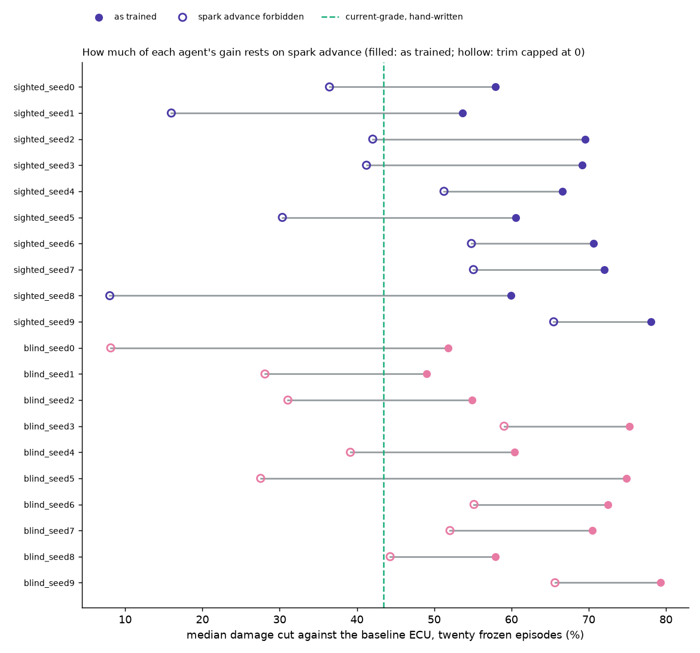

# Knock margin: the agents with spark advance forbidden

Generated by `python knock_margin.py` -- do not edit by hand. A diagnostic beside the twenty-episode protocol: each agent's own action, with its spark trim capped at 0 (no advance past the baseline ECU's knock-limited spark; retard allowed). The agents never trained with the cap, so everything they do after the spark differs is out of distribution.

- **Median cut, sighted:** 67.9 % as trained, **41.6 %** with advance forbidden. **Blinded:** 65.4 % -> **41.7 %**. Current-grade: 43.4 %.
- **9 of 20** still beat current-grade. The margin over it, median of all 20: **+24.4 points as trained, -1.8 with advance forbidden** (range -35.4 to +22.2).
- **Read it as a lower bound.** The agents learned everything else together with the spark advance; an agent TRAINED without the lever could do better than one that has it taken away. What it does show: most of the margin over the hand-written policies, as trained, comes from running closer to knock than the baseline does, which only the untested knock model allows.
- Knock integral on the climb, 95th percentile: 0.62-0.63 with the cap.
- **The ablation under the cap:** sighted minus blinded -0.95 points, 95 % CI -13.70 to +11.80, paired t p = 0.87, exact Wilcoxon p = 1.00, n = 10.
- Worst single episode with the cap: 2529 (blind_seed6), against the baseline's 920.

| agent | cut as trained | cut, advance forbidden | thermal-only, forbidden | over current-grade, forbidden | fuel vs baseline, forbidden | knock p95 on the climb |
|---|---|---|---|---|---|---|
| sighted_seed0 | 57.9 % | 36.4 % | 33.1 % | -7.0 | +3.64 % | 0.63 |
| sighted_seed1 | 53.7 % | 16.0 % | 12.2 % | -27.4 | +1.51 % | 0.62 |
| sighted_seed2 | 69.6 % | 42.0 % | 39.4 % | -1.4 | +4.96 % | 0.63 |
| sighted_seed3 | 69.1 % | 41.2 % | 41.1 % | -2.2 | +4.86 % | 0.63 |
| sighted_seed4 | 66.6 % | 51.3 % | 48.4 % | +7.8 | +6.57 % | 0.63 |
| sighted_seed5 | 60.6 % | 30.3 % | 27.3 % | -13.1 | +2.80 % | 0.63 |
| sighted_seed6 | 70.6 % | 54.8 % | 53.6 % | +11.4 | +8.22 % | 0.63 |
| sighted_seed7 | 72.0 % | 55.1 % | 54.8 % | +11.7 | +8.79 % | 0.63 |
| sighted_seed8 | 59.9 % | 8.0 % | 2.8 % | -35.4 | +3.21 % | 0.63 |
| sighted_seed9 | 78.1 % | 65.5 % | 64.4 % | +22.0 | +12.98 % | 0.63 |
| blind_seed0 | 51.8 % | 8.1 % | 2.4 % | -35.3 | +0.94 % | 0.63 |
| blind_seed1 | 49.0 % | 28.1 % | 25.5 % | -15.3 | +2.78 % | 0.63 |
| blind_seed2 | 54.9 % | 31.1 % | 30.1 % | -12.4 | +4.04 % | 0.63 |
| blind_seed3 | 75.3 % | 59.0 % | 62.0 % | +15.6 | +12.29 % | 0.63 |
| blind_seed4 | 60.4 % | 39.2 % | 37.5 % | -4.3 | +5.03 % | 0.63 |
| blind_seed5 | 74.9 % | 27.5 % | 26.1 % | -15.9 | +3.80 % | 0.63 |
| blind_seed6 | 72.5 % | 55.2 % | 57.1 % | +11.7 | +9.66 % | 0.63 |
| blind_seed7 | 70.4 % | 52.0 % | 53.2 % | +8.6 | +8.78 % | 0.63 |
| blind_seed8 | 58.0 % | 44.3 % | 43.2 % | +0.9 | +6.14 % | 0.63 |
| blind_seed9 | 79.3 % | 65.6 % | 65.3 % | +22.2 | +14.09 % | 0.63 |

