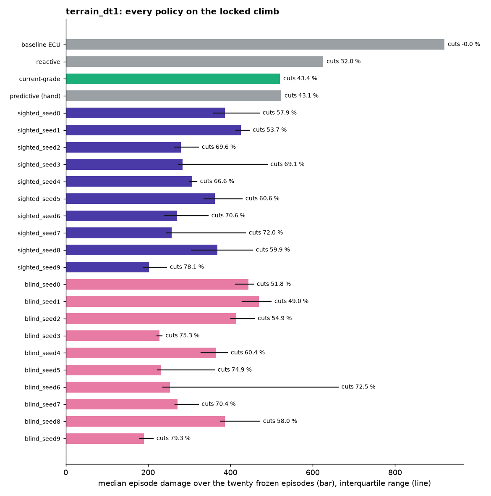
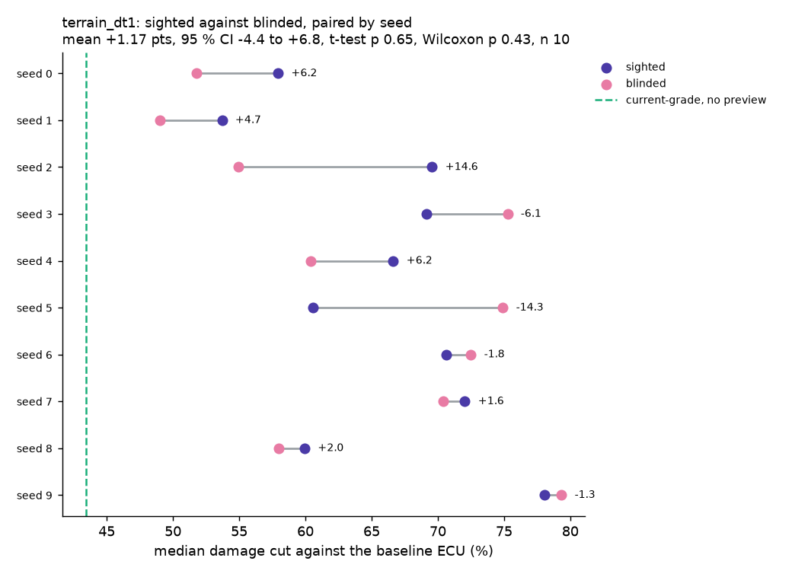
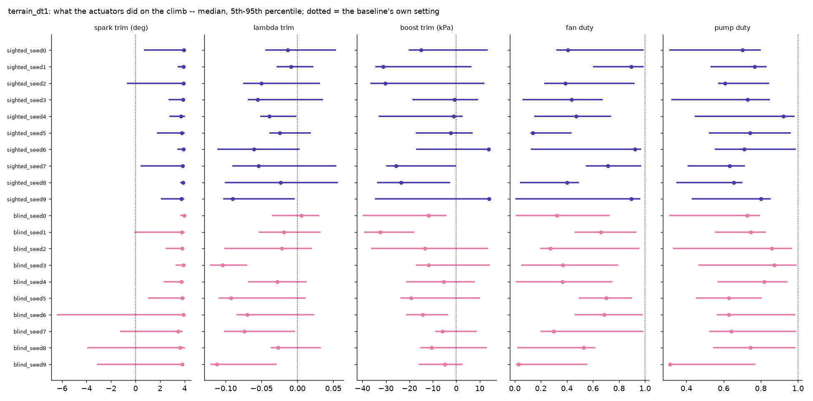
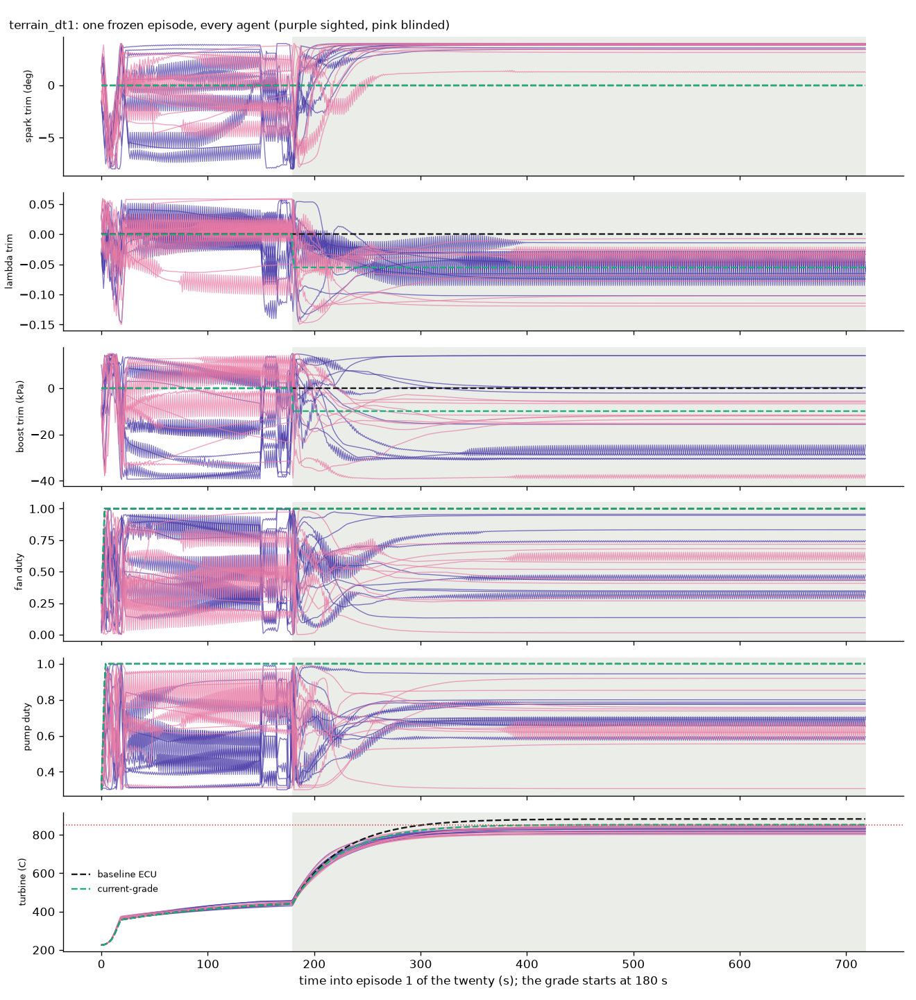
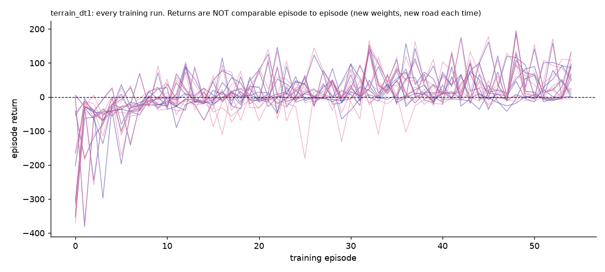

# Agents: `terrain_dt1`

Generated by `python record_agents.py` -- do not edit by hand; re-run it.

## How they were trained

- **roads**: a new road every episode (TerrainTrainingEnv)
- **dt**: 1.0
- **steps**: 50000
- **total_timesteps**: 50000
- **steps_per_episode**: 900
- **device**: cpu
- **git_commit**: cbb8d09
- **status**: finished
- **config_source**: written by train.py during training
- **SAC**: {"learning_rate": 0.0003, "buffer_size": 1000000, "batch_size": 256, "learning_starts": 100, "gamma": 0.99, "tau": 0.005, "train_freq": "TrainFreq(frequency=1, unit=<TrainFrequencyUnit.STEP: 'step'>)", "gradient_steps": 1, "ent_coef": "auto", "target_entropy": -5.0, "policy": "MlpPolicy", "net_arch": "[256, 256]"}
- **plant data fingerprint**: `{"data_sha1": "c4fdd4babfb3752a", "raw_logs": ["3aca2ec1-20260907_072817.csv", "3f64372e-20260907_070041.csv", "670063b2-20260907_142018.csv", "683640a0-2026090`

## Scored on the twenty frozen episodes (`evaluate.EPISODES`)

The locked 12 % / 130 km/h climb, 720 s at dt 1.0, 42 C. Scores are `evaluate.run_episode`'s; 0 episodes were compared with `results/phase_d_130kmh_raw.json` and are identical.

| policy | preview | median damage | IQR | worst | cut % | thermal-only cut % | fuel vs baseline % | peak turbine C | torque violation (median) | episodes trained | wall min |
|---|---|---|---|---|---|---|---|---|---|---|---|
| baseline ECU | no | 920.1 | 920-920 | 920.1 | 0.0 | 0.0 | +0.00 | 883 | 0.0 | - | - |
| reactive | no | 625.7 | 626-626 | 625.7 | 32.0 | 34.2 | +3.10 | 860 | 0.0 | - | - |
| current-grade | no | 520.5 | 521-521 | 520.5 | 43.4 | 47.2 | +5.87 | 853 | 0.0 | - | - |
| predictive (hand) | yes | 523.5 | 523-523 | 523.5 | 43.1 | 47.2 | +5.97 | 853 | 0.0 | - | - |
| sighted_seed0 | yes | 387.1 | 359-470 | 528.9 | 57.9 | 56.1 | -2.10 | 856 | 0.0 | 55 | 232.7 |
| sighted_seed1 | yes | 426.0 | 413-446 | 490.5 | 53.7 | 54.0 | -3.01 | 854 | 0.0 | 55 | 232.3 |
| sighted_seed2 | yes | 280.0 | 264-323 | 392.6 | 69.6 | 69.3 | +1.58 | 846 | 0.0 | 55 | 233.4 |
| sighted_seed3 | yes | 284.2 | 274-489 | 524.1 | 69.1 | 71.2 | +1.31 | 857 | 0.0 | 55 | 233.3 |
| sighted_seed4 | yes | 307.0 | 300-318 | 355.7 | 66.6 | 64.8 | +0.09 | 839 | 0.0 | 55 | 231.8 |
| sighted_seed5 | yes | 362.6 | 336-429 | 468.2 | 60.6 | 59.5 | -1.60 | 850 | 0.0 | 55 | 231.8 |
| sighted_seed6 | yes | 270.1 | 240-346 | 369.4 | 70.6 | 72.0 | +1.98 | 840 | 0.0 | 55 | 233.0 |
| sighted_seed7 | yes | 257.3 | 245-437 | 548.3 | 72.0 | 72.9 | +3.26 | 855 | 0.1 | 55 | 233.2 |
| sighted_seed8 | yes | 368.6 | 305-454 | 489.5 | 59.9 | 58.4 | -1.04 | 856 | 0.0 | 55 | 233.1 |
| sighted_seed9 | yes | 201.8 | 189-245 | 512.5 | 78.1 | 78.1 | +6.71 | 858 | 0.0 | 55 | 232.0 |
| blind_seed0 | no | 443.8 | 412-456 | 527.1 | 51.8 | 49.8 | -3.60 | 854 | 0.3 | 55 | 230.2 |
| blind_seed1 | no | 469.0 | 429-499 | 598.1 | 49.0 | 51.9 | -2.22 | 861 | 0.0 | 55 | 229.8 |
| blind_seed2 | no | 414.7 | 401-458 | 501.8 | 54.9 | 59.6 | -0.50 | 852 | 0.0 | 55 | 231.8 |
| blind_seed3 | no | 227.6 | 222-234 | 255.3 | 75.3 | 80.0 | +8.68 | 816 | 0.2 | 55 | 230.8 |
| blind_seed4 | no | 364.1 | 328-393 | 494.3 | 60.4 | 63.2 | -0.19 | 849 | 0.1 | 55 | 228.7 |
| blind_seed5 | no | 230.9 | 222-361 | 504.8 | 74.9 | 77.8 | +6.20 | 848 | 0.0 | 55 | 230.0 |
| blind_seed6 | no | 253.1 | 236-662 | 2526.7 | 72.5 | 75.8 | +4.49 | 932 | 0.0 | 55 | 231.0 |
| blind_seed7 | no | 272.1 | 265-322 | 534.7 | 70.4 | 73.8 | +5.54 | 851 | 0.0 | 55 | 231.3 |
| blind_seed8 | no | 386.8 | 376-471 | 567.1 | 58.0 | 58.7 | -0.32 | 853 | 0.0 | 55 | 231.0 |
| blind_seed9 | no | 190.2 | 180-212 | 371.6 | 79.3 | 80.4 | +9.90 | 834 | 0.0 | 55 | 229.4 |

## What stands out

- SPARK. On the climb every agent advances spark 3.5-4.0 deg past the baseline (median; the trim's upper bound is +4), whose own spark there is 1.2 deg. That takes the modelled knock integral from the baseline's 0.61 to 0.77-0.79 (95th percentile), just under the 0.85 knee where the damage model starts charging for knock. Part of what the agents save is margin the production-representative baseline keeps and the UNTESTED knock model says is not needed (CLAUDE.md, the knock model). Sighted and blinded do it alike, so it does not touch the ablation; it does touch every agent-versus-hand-written gap. How much of the gain it is: KNOCK_MARGIN.md beside this file (knock_margin.py), where it exists.
- BLIND_SEED6 does MORE damage than the baseline ECU on 5 of 20 episodes (numbers 7, 12, 14, 15, 16; worst 2527 against 920, peak turbine 932 C). Their weight on component life is 0.089, 0.034, 0.029, 0.049, 0.062 -- exactly the lowest in the frozen set. The reward lets an agent trade life for fuel when life is weighted that little; by evaluate.py's own standard a protection policy that is sometimes terrible is not one.
- 20 of 20 agents beat the best hand-written policy on median damage (43.4 % cut). 9 burn less fuel than the baseline.

## The ablation, paired by seed

Sighted minus blinded damage cut, 10 pairs: mean **+1.17** points (median +1.79, sd 7.84), 95 % CI -4.44 to +6.78; paired t-test p = 0.648, exact Wilcoxon p = 0.432 (the smallest this n can give is 0.0020). Thermal-only damage (no knock term): mean -1.50 points, t-test p = 0.559.

| seed | sighted cut % | blinded cut % | difference | sighted minus current-grade |
|---|---|---|---|---|
| 0 | 57.93 | 51.77 | +6.16 | +14.51 |
| 1 | 53.70 | 49.02 | +4.68 | +10.28 |
| 2 | 69.56 | 54.93 | +14.63 | +26.14 |
| 3 | 69.11 | 75.26 | -6.15 | +25.69 |
| 4 | 66.63 | 60.42 | +6.21 | +23.21 |
| 5 | 60.59 | 74.91 | -14.32 | +17.17 |
| 6 | 70.64 | 72.49 | -1.85 | +27.22 |
| 7 | 72.04 | 70.43 | +1.61 | +28.62 |
| 8 | 59.94 | 57.96 | +1.98 | +16.51 |
| 9 | 78.07 | 79.33 | -1.26 | +34.65 |

## What the actuators did

Applied values after the slew limit, over all twenty episodes; median and 5th-95th percentile, flat road | climb. `neutral` is the baseline's own setting (trims 0; fan and pump at what the baseline runs). `slew %` is the share of steps where the policy asked for more movement than the slew limit allowed.

| policy | spark trim (deg) | lambda trim | boost trim (kPa) | fan duty | pump duty |
|---|---|---|---|---|---|
| baseline ECU | 0.00 [0.00, 0.00] &#124; 0.00 [0.00, 0.00]; slew 0 % | 0.00 [0.00, 0.00] &#124; 0.00 [0.00, 0.00]; slew 0 % | 0.00 [0.00, 0.00] &#124; 0.00 [0.00, 0.00]; slew 0 % | 1.00 [1.00, 1.00] &#124; 1.00 [1.00, 1.00]; slew 0 % | 1.00 [1.00, 1.00] &#124; 1.00 [1.00, 1.00]; slew 1 % |
| reactive | 0.00 [0.00, 0.00] &#124; 0.00 [0.00, 0.00]; slew 0 % | 0.00 [0.00, 0.00] &#124; -0.04 [-0.04, 0.00]; slew 0 % | 0.00 [0.00, 0.00] &#124; -7.37 [-7.40, 0.00]; slew 0 % | 1.00 [1.00, 1.00] &#124; 1.00 [1.00, 1.00]; slew 0 % | 1.00 [1.00, 1.00] &#124; 1.00 [1.00, 1.00]; slew 1 % |
| current-grade | 0.00 [0.00, 0.00] &#124; 0.00 [0.00, 0.00]; slew 0 % | 0.00 [0.00, 0.00] &#124; -0.06 [-0.06, -0.06]; slew 0 % | 0.00 [0.00, 0.00] &#124; -9.90 [-9.90, -9.90]; slew 0 % | 1.00 [1.00, 1.00] &#124; 1.00 [1.00, 1.00]; slew 0 % | 1.00 [1.00, 1.00] &#124; 1.00 [1.00, 1.00]; slew 1 % |
| predictive (hand) | 0.00 [0.00, 0.00] &#124; 0.00 [0.00, 0.00]; slew 0 % | 0.00 [-0.06, 0.00] &#124; -0.06 [-0.06, -0.06]; slew 0 % | 0.00 [-9.90, 0.00] &#124; -9.90 [-9.90, -9.90]; slew 0 % | 1.00 [1.00, 1.00] &#124; 1.00 [1.00, 1.00]; slew 0 % | 1.00 [1.00, 1.00] &#124; 1.00 [1.00, 1.00]; slew 1 % |
| sighted_seed0 | 0.33 [-3.39, 2.67] &#124; 3.95 [0.73, 3.97]; slew 9 % | 0.01 [-0.04, 0.06] &#124; -0.01 [-0.04, 0.05]; slew 10 % | -18.86 [-30.77, 7.18] &#124; -14.98 [-19.96, 12.99]; slew 3 % | 0.84 [0.33, 0.97] &#124; 0.41 [0.32, 0.98]; slew 1 % | 0.58 [0.38, 0.94] &#124; 0.70 [0.31, 0.80]; slew 2 % |
| sighted_seed1 | 2.65 [-4.04, 3.91] &#124; 3.92 [3.48, 3.96]; slew 6 % | -0.01 [-0.05, 0.03] &#124; -0.01 [-0.03, 0.02]; slew 41 % | -33.74 [-39.06, 9.49] &#124; -31.18 [-34.22, 6.21]; slew 7 % | 0.30 [0.11, 0.99] &#124; 0.89 [0.61, 0.98]; slew 8 % | 0.75 [0.38, 0.94] &#124; 0.77 [0.53, 0.83]; slew 4 % |
| sighted_seed2 | 0.49 [-5.67, 3.65] &#124; 3.91 [-0.64, 3.96]; slew 8 % | 0.03 [-0.01, 0.05] &#124; -0.05 [-0.07, 0.03]; slew 28 % | -17.65 [-37.53, 10.44] &#124; -30.23 [-36.27, 11.64]; slew 6 % | 0.42 [0.12, 0.81] &#124; 0.39 [0.23, 0.91]; slew 1 % | 0.54 [0.38, 0.99] &#124; 0.61 [0.57, 0.84]; slew 1 % |
| sighted_seed3 | 1.17 [-3.03, 3.82] &#124; 3.86 [2.75, 3.93]; slew 11 % | 0.01 [-0.08, 0.04] &#124; -0.06 [-0.07, 0.03]; slew 22 % | -10.00 [-37.97, 9.68] &#124; -0.73 [-18.37, 9.07]; slew 4 % | 0.86 [0.09, 0.95] &#124; 0.43 [0.07, 0.67]; slew 4 % | 0.84 [0.53, 0.96] &#124; 0.73 [0.32, 0.84]; slew 9 % |
| sighted_seed4 | -3.58 [-6.01, 2.43] &#124; 3.69 [2.83, 3.97]; slew 10 % | 0.03 [-0.09, 0.04] &#124; -0.04 [-0.05, -0.00]; slew 26 % | -0.04 [-18.70, 13.42] &#124; -1.07 [-32.72, 2.33]; slew 4 % | 0.77 [0.19, 0.88] &#124; 0.47 [0.16, 0.73]; slew 5 % | 0.36 [0.31, 0.97] &#124; 0.92 [0.45, 0.98]; slew 11 % |
| sighted_seed5 | 2.83 [-4.43, 3.47] &#124; 3.78 [1.80, 3.93]; slew 7 % | 0.03 [-0.04, 0.05] &#124; -0.02 [-0.04, 0.02]; slew 26 % | 4.35 [-34.19, 13.70] &#124; -2.36 [-17.03, 6.75]; slew 4 % | 0.81 [0.12, 0.94] &#124; 0.14 [0.13, 0.43]; slew 2 % | 0.38 [0.31, 1.00] &#124; 0.74 [0.52, 0.96]; slew 2 % |
| sighted_seed6 | 1.00 [-5.36, 3.76] &#124; 3.90 [3.45, 3.95]; slew 6 % | 0.01 [-0.07, 0.05] &#124; -0.06 [-0.11, 0.00]; slew 31 % | -11.28 [-35.27, 13.20] &#124; 13.86 [-16.73, 14.19]; slew 20 % | 0.46 [0.05, 0.79] &#124; 0.92 [0.13, 0.96]; slew 11 % | 0.64 [0.35, 0.97] &#124; 0.71 [0.56, 0.98]; slew 2 % |
| sighted_seed7 | -0.90 [-7.90, 3.08] &#124; 3.83 [0.46, 3.93]; slew 7 % | -0.00 [-0.09, 0.04] &#124; -0.05 [-0.09, 0.05]; slew 69 % | -1.47 [-18.28, 10.48] &#124; -25.74 [-29.53, -0.41]; slew 12 % | 0.67 [0.13, 0.92] &#124; 0.72 [0.55, 0.97]; slew 6 % | 0.47 [0.31, 0.85] &#124; 0.63 [0.41, 0.71]; slew 3 % |
| sighted_seed8 | -3.19 [-7.35, 1.48] &#124; 3.88 [3.71, 3.95]; slew 14 % | 0.01 [-0.07, 0.04] &#124; -0.02 [-0.10, 0.06]; slew 38 % | -33.60 [-39.09, 13.45] &#124; -23.52 [-33.55, -2.95]; slew 5 % | 0.69 [0.01, 0.91] &#124; 0.40 [0.04, 0.49]; slew 2 % | 0.66 [0.30, 0.84] &#124; 0.65 [0.35, 0.70]; slew 3 % |
| sighted_seed9 | 0.18 [-4.95, 3.48] &#124; 3.74 [2.13, 3.89]; slew 13 % | 0.01 [-0.04, 0.05] &#124; -0.09 [-0.10, -0.01]; slew 14 % | 4.92 [-34.30, 10.00] &#124; 13.97 [-34.40, 14.42]; slew 1 % | 0.43 [0.16, 0.99] &#124; 0.89 [0.01, 0.96]; slew 11 % | 0.69 [0.35, 0.94] &#124; 0.80 [0.43, 0.85]; slew 7 % |
| blind_seed0 | 2.59 [-2.62, 3.93] &#124; 3.98 [3.71, 3.98]; slew 6 % | 0.01 [-0.03, 0.04] &#124; 0.01 [-0.03, 0.03]; slew 10 % | -27.87 [-33.96, -7.02] &#124; -11.71 [-39.59, -4.47]; slew 5 % | 0.50 [0.23, 0.83] &#124; 0.32 [0.01, 0.73]; slew 1 % | 0.63 [0.37, 0.75] &#124; 0.73 [0.31, 0.79]; slew 1 % |
| blind_seed1 | 3.58 [-4.34, 3.82] &#124; 3.78 [-0.02, 3.94]; slew 5 % | 0.05 [-0.01, 0.06] &#124; -0.02 [-0.05, 0.03]; slew 49 % | -11.86 [-23.14, 5.98] &#124; -32.33 [-38.95, -18.28]; slew 5 % | 0.13 [0.06, 0.40] &#124; 0.66 [0.46, 0.93]; slew 1 % | 0.89 [0.49, 0.96] &#124; 0.75 [0.56, 0.82]; slew 3 % |
| blind_seed2 | 3.03 [-4.25, 3.48] &#124; 3.81 [2.53, 3.89]; slew 3 % | 0.03 [-0.01, 0.06] &#124; -0.02 [-0.10, 0.02]; slew 24 % | 7.32 [-19.22, 14.78] &#124; -13.47 [-35.98, 13.20]; slew 8 % | 0.43 [0.10, 0.74] &#124; 0.27 [0.20, 0.95]; slew 2 % | 0.67 [0.58, 0.87] &#124; 0.86 [0.33, 0.96]; slew 9 % |
| blind_seed3 | 0.53 [-4.52, 3.17] &#124; 3.92 [3.33, 3.99]; slew 6 % | -0.01 [-0.03, 0.02] &#124; -0.10 [-0.12, -0.07]; slew 44 % | 4.29 [-16.68, 14.29] &#124; -11.87 [-17.01, 14.04]; slew 8 % | 0.60 [0.36, 0.81] &#124; 0.37 [0.06, 0.79]; slew 11 % | 0.72 [0.38, 0.89] &#124; 0.87 [0.47, 0.99]; slew 2 % |
| blind_seed4 | -0.82 [-5.64, 3.78] &#124; 3.76 [2.34, 3.89]; slew 4 % | -0.01 [-0.11, 0.04] &#124; -0.03 [-0.07, 0.01]; slew 16 % | -1.77 [-6.96, 9.66] &#124; -5.36 [-21.10, 7.51]; slew 3 % | 0.53 [0.28, 0.89] &#124; 0.36 [0.01, 0.74]; slew 2 % | 0.70 [0.51, 0.80] &#124; 0.82 [0.57, 0.94]; slew 1 % |
| blind_seed5 | 1.02 [-3.12, 2.52] &#124; 3.80 [1.09, 3.93]; slew 25 % | 0.01 [-0.02, 0.03] &#124; -0.09 [-0.11, 0.01]; slew 35 % | -0.45 [-13.08, 12.87] &#124; -19.31 [-23.44, 9.92]; slew 17 % | 0.28 [0.05, 0.57] &#124; 0.70 [0.50, 0.89]; slew 6 % | 0.67 [0.37, 0.95] &#124; 0.63 [0.46, 0.80]; slew 18 % |
| blind_seed6 | -4.43 [-7.53, 0.86] &#124; 3.89 [-6.35, 3.94]; slew 7 % | 0.05 [-0.11, 0.06] &#124; -0.07 [-0.08, 0.02]; slew 23 % | -19.34 [-32.00, -2.54] &#124; -14.24 [-20.97, -3.78]; slew 2 % | 0.88 [0.01, 0.97] &#124; 0.68 [0.47, 0.98]; slew 1 % | 0.71 [0.52, 0.85] &#124; 0.63 [0.57, 0.98]; slew 1 % |
| blind_seed7 | 0.76 [-4.23, 3.78] &#124; 3.47 [-1.18, 3.77]; slew 18 % | 0.00 [-0.06, 0.05] &#124; -0.07 [-0.10, -0.00]; slew 31 % | -2.87 [-25.40, 7.97] &#124; -5.99 [-8.63, 8.54]; slew 4 % | 0.46 [0.03, 0.84] &#124; 0.30 [0.20, 0.98]; slew 3 % | 0.62 [0.31, 0.78] &#124; 0.64 [0.53, 0.99]; slew 1 % |
| blind_seed8 | -1.57 [-3.66, 2.97] &#124; 3.63 [-3.87, 3.97]; slew 4 % | -0.01 [-0.04, 0.02] &#124; -0.03 [-0.04, 0.03]; slew 29 % | 12.07 [-4.74, 13.59] &#124; -10.53 [-15.15, 12.80]; slew 9 % | 0.06 [0.01, 0.81] &#124; 0.53 [0.02, 0.61]; slew 2 % | 0.31 [0.31, 0.47] &#124; 0.74 [0.55, 0.98]; slew 1 % |
| blind_seed9 | 0.51 [-3.56, 2.18] &#124; 3.82 [-3.09, 3.89]; slew 15 % | 0.02 [-0.02, 0.05] &#124; -0.11 [-0.12, -0.03]; slew 10 % | -10.01 [-28.33, 12.93] &#124; -4.85 [-15.62, 2.42]; slew 1 % | 0.35 [0.19, 0.62] &#124; 0.03 [0.01, 0.55]; slew 1 % | 0.79 [0.42, 0.97] &#124; 0.31 [0.31, 0.77]; slew 1 % |

## Files

Per policy, in its folder: `eval_summary.json` (every episode scored), `eval_record.npz` (every step of the twenty episodes, arrays `[episode, step, ...]`: `action`, `applied`, `obs`, `reward`, `r_fuel`, `r_life`, `r_resp`, `rpm`, `map_kpa`, `grade`, `spark`, `lam`, `torque`, `torque_req`, `ki`, `egt_c`, `mdot_fuel`, `t_turb`, `t_oil`, `t_block`, `t_turb_base`, `damage_rate`, plus `episode_seed` and `weights`). Per agent also: `config.json`, `curve.csv`, `policy.npz` (the actor's weights) and, for agents trained since 29 September, `train_record.npz` (every training step: `step`, `episode`, `action`, `obs`, `reward`, the reward terms and the engine state).

**The two `*_record.npz` files are kept on disk and not in git** (the team's decision, 29 September: 85 MB of binaries). They stay on the machine that trained the agents, beside the models in `runs/` (also gitignored): only there can `python record_agents.py <set>` regenerate `eval_record.npz`, and `train_record.npz` cannot be regenerated at all. Everything else here is committed, and `eval_summary.json` carries the statistics read from the records.

## Figures

